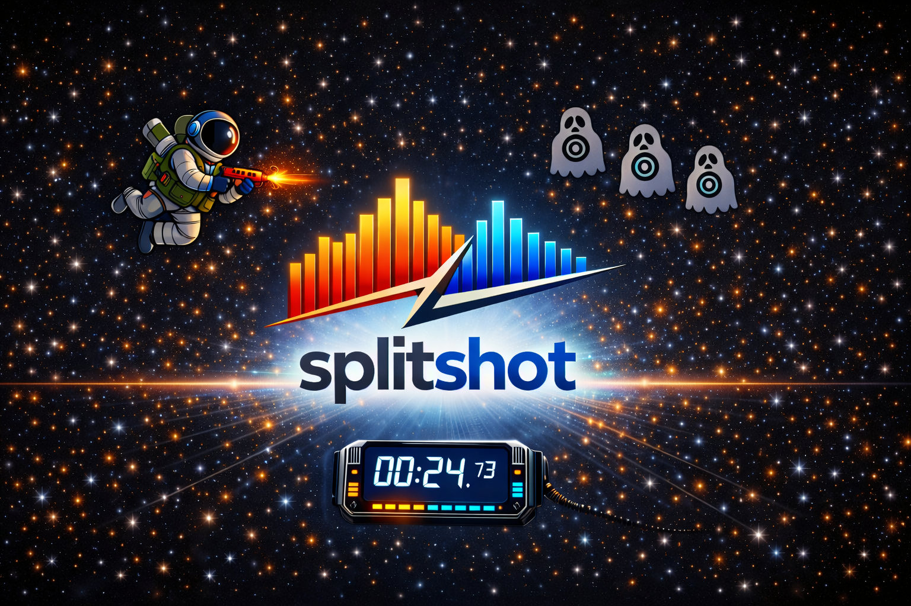
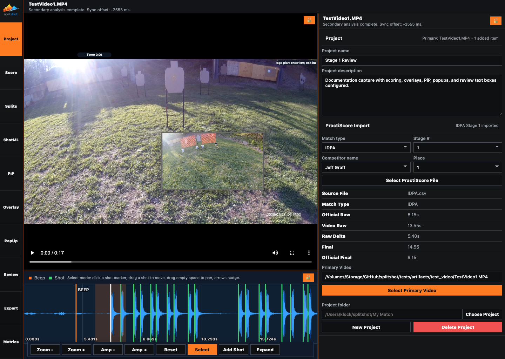

<p align="center">
	
</p>

# SplitShot

SplitShot is a local-first browser app for competition shooting video analysis, split timing, scoring, PiP review, overlay tuning, metrics, and final video export.



## What SplitShot Does

- Imports a local stage video and keep the whole workflow on your machine. SplitShot works directly from files on disk, so you can load match footage, reopen saved projects, and keep your training and match videos out of the cloud.
- Detects the timer beep and shot events from the video's audio with a local analysis pass. SplitShot builds an initial shooting timeline for you instead of making you mark every shot by hand from scratch.
- Reviews and correct split timing in the waveform editor. You can inspect the detected events, adjust bad markers, add missing timing events, remove false positives, and make the timeline match what actually happened on the run.
- Score sthe run manually or load PractiScore context for the same stage. That gives you a fast path whether you are doing ad hoc review, building a stage breakdown from memory, or aligning the video with official stage and competitor context.
- Tunes on-video shot badges, timer badges, score summaries, and review text boxes with live preview feedback. You can control what appears on the video, how it is styled, and how much analysis detail the finished clip should surface to the viewer.
- Adds PiP, SbS, and UaB media such as a second angle or still images. SplitShot lets you bring in supporting visuals, place them where they belong, and use them to clarify positions, transitions, makeup shots, or stage design details.
- Reviews derived metrics, then export CSV or text summaries. The app turns the corrected timeline and scoring data into usable output for post-stage review, coaching notes, spreadsheets, or sharing outside the app.
- Renders a finished local video with FFmpeg. Your final export can include the corrected timing, overlays, review annotations, PiP media, and presentation choices you made during analysis.

## Install SplitShot

SplitShot runs directly from this repository. You need this repo, `uv`, `ffmpeg`, and the browser you already use.

### 1. Automated Install

If you downloaded the ZIP instead of cloning with Git, unzip it first and run the same commands from that folder.

#### macOS or Linux

```bash
git clone https://github.com/jklock/splitshot.git
cd splitshot
bash scripts/setup/setup_splitshot.sh
uv run splitshot
```

#### Windows PowerShell

```powershell
git clone https://github.com/jklock/splitshot.git
Set-Location .\splitshot
powershell -ExecutionPolicy Bypass -File .\scripts\setup\setup_splitshot.ps1
uv run splitshot
```

Optional check:

```bash
uv run splitshot --check
```

### 2. Manual Install

#### macOS

```bash
brew install uv ffmpeg
git clone https://github.com/jklock/splitshot.git
cd splitshot
uv python install 3.12
uv sync
uv run splitshot
```

#### Linux

```bash
# install uv and ffmpeg first with your package manager
git clone https://github.com/jklock/splitshot.git
cd splitshot
uv python install 3.12
uv sync
uv run splitshot
```

#### Windows PowerShell

```powershell
winget install --id astral-sh.uv --exact --accept-source-agreements --accept-package-agreements
winget install --id Gyan.FFmpeg --exact --accept-source-agreements --accept-package-agreements
git clone https://github.com/jklock/splitshot.git
Set-Location .\splitshot
uv python install 3.12
uv sync
uv run splitshot
```

## Basic Workflow

1. Open SplitShot in your browser.
2. Select the primary video, or paste a direct local path and press Enter for very large files.
3. Wait for local analysis to detect the beep and shots.
4. Fix timing in Splits before you score or style anything.
5. Import PractiScore if you want official stage context.
6. Use Score, Overlay, and Review to set the scoring and on-video presentation.
7. Add PiP media if you want a second angle or supporting images.
8. Export the final video.

## App Guides

- [Project](docs/userfacing/panes/project.md)
- [Splits](docs/userfacing/panes/splits.md)
- [Score](docs/userfacing/panes/score.md)
- [PiP](docs/userfacing/panes/pip.md)
- [Overlay](docs/userfacing/panes/overlay.md)
- [Review](docs/userfacing/panes/review.md)
- [Export](docs/userfacing/panes/export.md)
- [Metrics](docs/userfacing/panes/metrics.md)

## More Documentation

- [Full user guide](docs/userfacing/USER_GUIDE.md)
- [Workflow guide](docs/userfacing/workflow.md)
- [Troubleshooting](docs/userfacing/troubleshooting.md)
- [Documentation hub](docs/README.md)
- [Current limitations](docs/project/LIMITATIONS.md)

## License

SplitShot is licensed under the MIT License. See [LICENSE](LICENSE).

**Last updated:** 2026-04-18
**Referenced files last updated:** 2026-04-18
