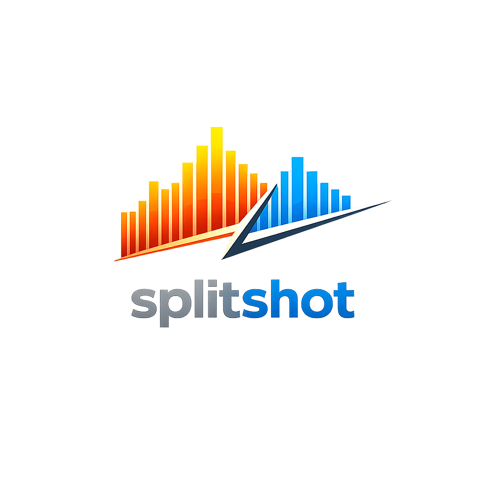

<p align="center">
	
</p>

# SplitShot

Local-first competition shooting video analysis, merge, scoring, and export.

## Documentation

- Project documentation hub: [docs/README.md](docs/README.md)
- Architecture and data flow: [docs/ARCHITECTURE.md](docs/ARCHITECTURE.md)
- Development workflow: [docs/DEVELOPING.md](docs/DEVELOPING.md)
- Known constraints: [docs/LIMITATIONS.md](docs/LIMITATIONS.md)
- End-user guide: [docs/USER_GUIDE.md](docs/USER_GUIDE.md)
- Package-level technical docs live beside the source in `src/splitshot/.../README.md`.

## Setup

SplitShot uses `uv` to provision its pinned Python 3.12 environment. You do not need a separate system Python install if you launch it through `uv`, but you do need `uv` plus FFmpeg and FFprobe on your `PATH`. If you want to use `python` directly outside `uv`, install Python 3.12 separately as well.

### macOS

1. Install Homebrew if you do not already have it.
2. Install the required tools:

```bash
/bin/bash -c "$(curl -fsSL https://raw.githubusercontent.com/Homebrew/install/HEAD/install.sh)"
brew install git uv ffmpeg
```

3. Verify that the tools resolve from a fresh terminal:

```bash
uv --version
ffmpeg -version
ffprobe -version
```

4. Clone the repository and enter it:

```bash
git clone https://github.com/jklock/splitshot.git
cd splitshot
```

5. Install SplitShot's Python dependencies plus the test and packaging extras:

```bash
uv sync --all-extras
```

6. Start the browser UI:

```bash
uv run splitshot
```

7. Optional commands:

```bash
uv run splitshot --desktop
uv run splitshot --no-open
```

### Windows

1. Install Git if it is not already present.
2. Install `uv`:

```powershell
powershell -c "irm https://astral.sh/uv/install.ps1 | iex"
```

3. Download a Windows FFmpeg build that includes both `ffmpeg.exe` and `ffprobe.exe`, extract it to a stable folder such as `C:\Tools\ffmpeg`, and keep the `bin` folder handy.
4. Add FFmpeg to `PATH`:
   - Open Start and search for `Environment Variables`.
   - Open `Edit the system environment variables`.
   - Click `Environment Variables`.
   - Under either User variables or System variables, select `Path` and click `Edit`.
   - Click `New` and add the folder that contains `ffmpeg.exe` and `ffprobe.exe`, for example `C:\Tools\ffmpeg\bin`.
   - Click `OK` through every dialog, then open a new PowerShell or Windows Terminal window so the updated `PATH` loads.
5. Verify the installation from a fresh terminal:

```powershell
uv --version
ffmpeg -version
ffprobe -version
```

6. Clone the repository and install dependencies:

```powershell
git clone https://github.com/jklock/splitshot.git
Set-Location splitshot
uv sync --all-extras
```

7. Run SplitShot:

```powershell
uv run splitshot
uv run splitshot --desktop
uv run splitshot --no-open
```

If you would rather not edit `PATH`, set `SPLITSHOT_FFMPEG_DIR` to the folder that contains `ffmpeg.exe` and `ffprobe.exe` before launching SplitShot.

## Run

Once setup is complete, the day-to-day commands are below. The browser UI opens locally at `127.0.0.1:8765`, and `--desktop` starts the PySide6 window.

```bash
uv run splitshot
uv run splitshot --desktop
uv run splitshot --no-open
uv run splitshot --check
```

Compatibility aliases are also available:

```bash
uv run splitshot-web
uv run splitshot-desktop
```

## Validation

Use these commands to confirm the install and the local toolchain.

```bash
uv run pytest
uv run splitshot --check
```

## Export

SplitShot exports with local FFmpeg. The app renders the selected video/merge, overlays, and scoring into frames, then encodes a local video file with the selected export variables.

Browser export controls expose:

- Presets: Source MP4, Universal Vertical Master, Short-Form Vertical, YouTube Long-Form 1080p, YouTube Long-Form 4K, and Custom.
- Video: aspect ratio, crop center, target width/height, source/30/60 fps, H.264 or HEVC, bitrate, FFmpeg preset, and optional two-pass encode.
- Audio: AAC, sample rate, and bitrate.
- Color: Rec.709 SDR.
- Containers: output path extensions `.mp4`, `.m4v`, `.mov`, and `.mkv` are supported.
- Logs: the Export pane stores the FFmpeg command/log output for the last export so failures are visible.

Browser file pickers and typed-path imports support common stage containers including `.mp4`, `.m4v`, `.mov`, `.avi`, `.wmv`, `.webm`, `.mkv`, `.mpg`, `.mpeg`, `.mts`, and `.m2ts`.

## Packaging

The source package is browser-first and runnable with one command through `uv run splitshot`. The repository includes `.python-version` with Python 3.12, so `uv` creates/uses the right virtual environment without requiring `--python 3.12` on every command. Native `.dmg` and `.exe` artifacts are intentionally not required for the current workflow.

The app needs `ffmpeg` and `ffprobe`. During development it finds them from `PATH`; packaged/source distributions can also point to bundled binaries with `SPLITSHOT_FFMPEG_DIR`.

## License

SplitShot is licensed under the MIT License. See [LICENSE](LICENSE).
