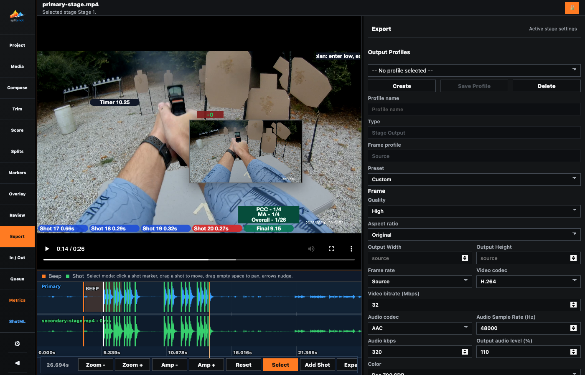

<p align="center">
	
</p>

# SplitShot

SplitShot is a local-first browser app for competition shooting video analysis, split timing, scoring, review overlays, PiP comparison, metrics, and final video export.



## Start Here

If you are new to SplitShot, start here:

1. Releases page: [github.com/jklock/splitshot/releases](https://github.com/jklock/splitshot/releases)
2. macOS:
   download the current DMG from Releases, open it, and launch SplitShot like a normal macOS app.
3. Windows:
   download the current Windows installer from Releases, run it, and launch SplitShot from the installed app entry.
4. Linux:
   download the current Linux package from Releases, make it executable if needed, and launch SplitShot from the packaged app.
5. If you are building or running SplitShot directly from the repo, use the `Platform-Specific Local Use` section below.
6. Use the `Quickstart` section below to get from install to first project quickly.
7. Continue with [docs/userfacing/USER_GUIDE.md](docs/userfacing/USER_GUIDE.md) for the full app walkthrough.

If you just forked the repo and want maintainer context, use the developer section near the bottom after you finish the user-facing install path.

## SplitShot Features

- **Local video-first workflow:** Import stage footage directly from disk, keep your raw files on your own machine, and work without handing match video to a cloud service.
- **Automatic start beep and shot detection:** Run the built-in ShotML pipeline to detect the start beep and likely shot events so you begin from a populated timing draft instead of a blank timeline.
- **Manual timing correction and review:** Inspect waveform markers, nudge or drag shot positions, add missing events, remove false positives, and make the final timeline match what actually happened on the run.
- **Stage scoring with optional PractiScore context:** Score the run manually or import official stage and competitor context from PractiScore so timing, scoring, and final presentation stay tied to the same source data.
- **Overlay, marker, and review composition:** Build export-ready timer badges, shot badges, score summaries, review text boxes, and marker callouts that stay visible in preview and final render.
- **PiP and multi-angle comparison:** Add secondary videos or stills, place them as PiP, side-by-side, or above-below layouts, and tune sync and opacity to clarify transitions or positions.
- **Post-stage metrics and export summaries:** Review timing graphs, expanded tables, CSV/text exports, and run summaries derived from the same corrected project state.
- **Local final video rendering:** Export a finished video through FFmpeg with your chosen timing, overlays, review text, added media, and presentation settings.

## Quickstart for Local Use

1. Install SplitShot using the platform section below.
2. Launch SplitShot from source with `uv run splitshot` or from the Electron shell with `npm start` inside `electron/`.
3. Open or create a `.ssproj` bundle in the `Project` pane so the rest of the import and save controls are enabled.
4. Import the primary stage video, wait for analysis to build the waveform and initial shot timeline, and confirm that the start beep and shot count look plausible.
5. If the first pass is off, adjust detection in `ShotML`, rerun analysis, and only then move into manual cleanup in `Splits`.
6. Use `Splits` to correct timing, add or remove shots, review timing events, and make the final timeline match the footage before deeper presentation work.
7. Import PractiScore context if you need official stage and competitor data, then finish scoring in `Score`.
8. Add secondary media in `PiP`, create marker callouts in `Markers`, tune badges in `Overlay`, and configure text boxes and visibility in `Review`.
9. Check `Metrics` for the post-stage timing and scoring summary, then finish in `Export` with the output path, codec, and render settings you want.

For the full user workflow, continue with [docs/userfacing/workflow.md](docs/userfacing/workflow.md).

## Platform-Specific Local Use

### macOS

- Electron locally:
  ```bash
  git clone https://github.com/jklock/splitshot.git
  cd splitshot/electron
  npm install
  npm start
  ```
- Electron build target:
  ```bash
  npm run build:mac
  ```
- Source locally:
  ```bash
  git clone https://github.com/jklock/splitshot.git
  cd splitshot
  uv python install 3.12
  uv sync --extra dev
  uv run splitshot
  ```
- If the browser does not open automatically:
  rerun with `uv run splitshot --no-open` and open the printed URL manually.
- Release/signing details:
  [docs/project/ELECTRON_RELEASE.md](docs/project/ELECTRON_RELEASE.md)

### Windows

- Electron locally:
  ```powershell
  git clone https://github.com/jklock/splitshot.git
  cd splitshot\electron
  npm install
  npm start
  ```
- Electron build target:
  ```powershell
  npm run build:win
  ```
- Source locally:
  ```powershell
  git clone https://github.com/jklock/splitshot.git
  cd splitshot
  uv python install 3.12
  uv sync --extra dev
  uv run splitshot
  ```
- If the browser does not open automatically:
  rerun with `uv run splitshot --no-open`.
- Current limitation:
  Windows packaging and smoke coverage exist in CI, but macOS remains the deepest documented signing/notarization path.

### Linux

- Electron locally:
  ```bash
  git clone https://github.com/jklock/splitshot.git
  cd splitshot/electron
  npm install
  npm start
  ```
- Electron build target:
  ```bash
  npm run build:linux
  ```
- Source locally:
  ```bash
  git clone https://github.com/jklock/splitshot.git
  cd splitshot
  uv python install 3.12
  uv sync --extra dev
  uv run splitshot
  ```
- If the browser does not open automatically:
  rerun with `uv run splitshot --no-open`.
- Current limitation:
  Linux packaging and smoke coverage exist in CI, but macOS remains the deepest documented signing/notarization path.

## SplitShot Arguments

SplitShot starts in browser mode by default. These are the supported CLI arguments from `splitshot`:

- `uv run splitshot`
  Starts the normal local browser workflow with the desktop runtime.
- `uv run splitshot --web`
  Explicitly requests the browser control interface. This matches the default behavior.
- `uv run splitshot --headless`
  Starts the HTTP server without the desktop GUI so you can use the browser interface without Qt window hosting.
- `uv run splitshot --host 127.0.0.1`
  Overrides the bind host for the local browser server.
- `uv run splitshot --port 8765`
  Overrides the bind port for the local browser server.
- `uv run splitshot --no-open`
  Starts the app without automatically opening the browser.
- `uv run splitshot --log-level off|error|warning|info|debug`
  Mirrors browser activity logs to the terminal at or above the selected level while keeping file logging enabled.
- `uv run splitshot --project /path/to/project.ssproj`
  Opens an existing `.ssproj` bundle at startup.
- `uv run splitshot --check`
  Runs the runtime/toolchain check for FFmpeg, FFprobe, Qt WebEngine, native dialog support, and required browser assets.

## User Documentation

Start here for product usage:

- [docs/userfacing/USER_GUIDE.md](docs/userfacing/USER_GUIDE.md)
- [docs/userfacing/workflow.md](docs/userfacing/workflow.md)
- [docs/userfacing/troubleshooting.md](docs/userfacing/troubleshooting.md)
- [docs/userfacing/panes/](docs/userfacing/panes/)

## Developer Documentation

Use these after the user-facing install and workflow docs:

- [docs/README.md](docs/README.md): full documentation index by audience
- [CHANGELOG.md](CHANGELOG.md): release history and launch-grade notes
- [docs/project/DEVELOPING.md](docs/project/DEVELOPING.md): local setup, daily workflow, and first engineering reads
- [docs/project/ARCHITECTURE.md](docs/project/ARCHITECTURE.md): runtime layers, controller/model boundaries, and data flow
- [docs/project/GOVERNANCE.md](docs/project/GOVERNANCE.md): branch lifecycle, protections, and release-tag policy
- [docs/project/V1_1_AUDIT.md](docs/project/V1_1_AUDIT.md): `v1.1` audit-first baseline, frozen non-regression contract, and worklist format
- [src/splitshot/README.md](src/splitshot/README.md): source tree map and subsystem entrypoints
- [docs/tests/TEST_SUITE_GUIDE.md](docs/tests/TEST_SUITE_GUIDE.md): validation and suite ownership
- [scripts/README.md](scripts/README.md): scripts, audits, and release helpers
- [docs/project/LIMITATIONS.md](docs/project/LIMITATIONS.md): current repo/runtime constraints
- [CONTRIBUTING.md](CONTRIBUTING.md): contribution workflow and review expectations

## License

SplitShot is licensed under the MIT License. See [LICENSE](LICENSE).

## Support SplitShot

<a href="https://buymeacoffee.com/glockenkemper" target="_blank" rel="noopener noreferrer">
  
</a>

## Special Thanks

Will Price - Thanks for all the help so far beta testing the Windows version :)

