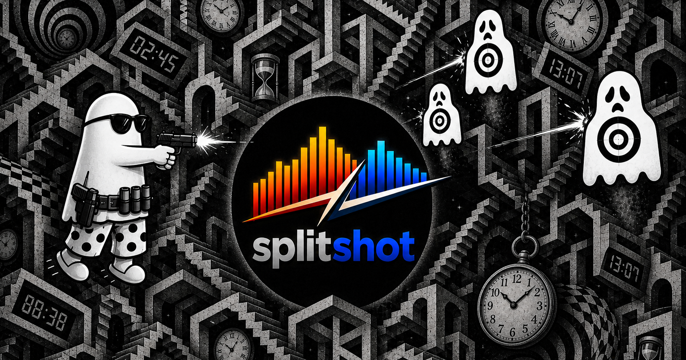

<p align="center">
	
</p>

# SplitShot

SplitShot is a local-first browser app for competition shooting video analysis, split timing, scoring, review overlays, PiP comparison, metrics, and final video export.


## Start Here

If you are new to SplitShot:

1. Read this `README.md` for platform-specific install and launch paths.
2. Use the `Quickstart` section below to get from install to first project quickly.
3. Continue with [docs/userfacing/USER_GUIDE.md](docs/userfacing/USER_GUIDE.md) for the full app walkthrough.

If you just forked the repo and want maintainer context, use the developer section near the bottom after you finish the user-facing install path.

## SplitShot Features

- **Local video-first workflow:** Import stage footage directly from disk, keep your raw files on your own machine, and work without handing match video to a cloud service.
- **Automatic start beep and shot detection:** Run the built-in ShotML pipeline to detect the start beep and likely shot events so you begin from a populated timing draft instead of a blank timeline.
- **Manual timing correction and review:** Inspect waveform markers, nudge or drag shot positions, add missing events, remove false positives, and make the final timeline match what actually happened on the run.
- **Stage scoring with optional PractiScore context:** Score the run manually or import official stage and competitor context from PractiScore so timing, scoring, and final presentation stay tied to the same source data.
- **Overlay, marker, and review composition:** Build export-ready timer badges, shot badges, score summaries, review text boxes, and marker callouts that stay visible in preview and final render.
- **PiP and multi-angle comparison:** Add secondary videos or stills, place them as PiP, side-by-side, or above-below layouts, and tune sync and opacity to clarify transitions or positions.
- **Post-stage metrics and export summaries:** Review timing graphs, expanded tables, CSV/text exports, and run summaries derived from the same corrected project state.
- **Local final video rendering:** Export a finished video through FFmpeg with your chosen timing, overlays, review text, added media, and presentation settings.

## Quickstart

1. Install SplitShot using the platform section below.
2. Launch the app from source or through the Electron shell.
3. Create or select a project in the `Project` pane.
4. Import the primary video and let SplitShot detect the start beep and shots.
5. Review timing in `ShotML` and `Splits`.
6. Score the run, configure overlay/review output, and add PiP media if needed.
7. Review metrics, then export the final video.

For the full user workflow, continue with [docs/userfacing/workflow.md](docs/userfacing/workflow.md).

## Install - macOS

### Electron install and use

The Electron shell is the native desktop packaging path for SplitShot. From a local clone:

```bash
git clone https://github.com/jklock/splitshot.git
cd splitshot/electron
npm install
npm start
```

Useful Electron commands:

- `npm run build:mac` builds the macOS DMG packaging target.
- `npm test` runs the Electron launch-intent and smoke tests.
- [docs/project/ELECTRON_RELEASE.md](docs/project/ELECTRON_RELEASE.md) covers signing and notarization details.

### Source-clone install and use

```bash
git clone https://github.com/jklock/splitshot.git
cd splitshot
uv python install 3.12
uv sync --extra dev
uv run splitshot
```

If the browser does not open automatically, retry with `uv run splitshot --no-open` and open the printed URL manually.

## Install - Windows

### Electron install and use

SplitShot includes a configured Windows Electron target through `electron-builder`:

```powershell
git clone https://github.com/jklock/splitshot.git
cd splitshot\electron
npm install
npm start
```

Useful Electron commands:

- `npm run build:win` builds the Windows NSIS installer target.
- `npm test` runs the Electron launch-intent and smoke tests.
- Windows packaging is configured in-repo, but it is not CI-tested at the same depth as the macOS packaging path.

### Source-clone install and use

```powershell
git clone https://github.com/jklock/splitshot.git
cd splitshot
uv python install 3.12
uv sync --extra dev
uv run splitshot
```

Use `uv run splitshot --no-open` if the browser does not open automatically.

## Install - Linux

### Electron install and use

SplitShot includes a configured Linux Electron target through `electron-builder`:

```bash
git clone https://github.com/jklock/splitshot.git
cd splitshot/electron
npm install
npm start
```

Useful Electron commands:

- `npm run build:linux` builds the Linux AppImage target.
- `npm test` runs the Electron launch-intent and smoke tests.
- Linux packaging is configured in-repo, but it is not CI-tested at the same depth as the macOS packaging path.

### Source-clone install and use

```bash
git clone https://github.com/jklock/splitshot.git
cd splitshot
uv python install 3.12
uv sync --extra dev
uv run splitshot
```

Use `uv run splitshot --no-open` if the browser does not open automatically.

## Runtime Check

Run this after setup on any platform:

```bash
uv run splitshot --check
```

## User Documentation

Start here for product usage:

- [docs/userfacing/USER_GUIDE.md](docs/userfacing/USER_GUIDE.md)
- [docs/userfacing/workflow.md](docs/userfacing/workflow.md)
- [docs/userfacing/troubleshooting.md](docs/userfacing/troubleshooting.md)
- [docs/userfacing/panes/](docs/userfacing/panes/)

## Developer Documentation

Use these after the user-facing install and workflow docs:

- [docs/README.md](docs/README.md): full documentation index by audience
- [docs/project/DEVELOPING.md](docs/project/DEVELOPING.md): local setup, daily workflow, and first engineering reads
- [docs/project/ARCHITECTURE.md](docs/project/ARCHITECTURE.md): runtime layers, controller/model boundaries, and data flow
- [src/splitshot/README.md](src/splitshot/README.md): source tree map and subsystem entrypoints
- [docs/tests/TEST_SUITE_GUIDE.md](docs/tests/TEST_SUITE_GUIDE.md): validation and suite ownership
- [scripts/README.md](scripts/README.md): scripts, audits, and release helpers
- [docs/project/LIMITATIONS.md](docs/project/LIMITATIONS.md): current repo/runtime constraints
- [CONTRIBUTING.md](CONTRIBUTING.md): contribution workflow and review expectations

## License

SplitShot is licensed under the MIT License. See [LICENSE](LICENSE).

## Support SplitShot

[buymeacoffee.com/glockenkemper](https://buymeacoffee.com/glockenkemper)
