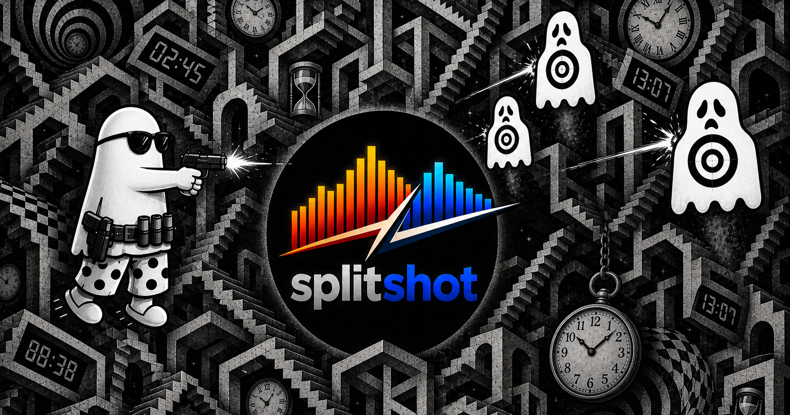
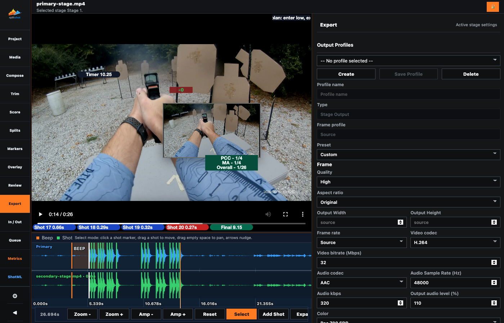

<p align="center">
  
</p>

# SplitShot

SplitShot is a local-first desktop app for competition shooting video analysis, timing, scoring, multi-angle composition, metrics, and finished-video export. Your projects and media stay on your computer.



## Get SplitShot

Download the package for your platform from [Releases](https://github.com/jklock/splitshot/releases):

- **macOS:** open the DMG and drag or open SplitShot as prompted by macOS.
- **Windows:** run the installer, then open SplitShot from the installed app entry.
- **Linux:** download the AppImage, make it executable if your desktop does not do so automatically, then launch it.

## First Project

1. Open **Project** and create a project in an empty folder, or open a folder that already contains `project.json`.
2. In **Media**, add a stage and import its primary video. SplitShot keeps imported media in the project `Input` folder.
3. Run **ShotML** to find a start beep and likely shots, then use **Splits** to correct the timeline.
4. Add official match context in **Project** and finish the run in **Score** when needed.
5. Use **Compose**, **Trim**, **Markers**, **Overlay**, and **Review** to prepare the presentation.
6. Check **Metrics**, choose output settings in **Export**, optionally configure **In / Out**, then use **Queue** to render the stage or a combined match video.

The left rail is ordered for that workflow: `Project`, `Media`, `Compose`, `Trim`, `Score`, `Splits`, `Markers`, `Overlay`, `Review`, `Export`, `In / Out`, `Queue`, `Metrics`, `ShotML`, and `Settings`.

## Features

- Work locally with stage footage, projects, and exported video.
- Detect start beeps and likely shots, then refine every timing event manually.
- Import PractiScore context or score a run directly in SplitShot.
- Compose added video or still media and align it with the primary recording.
- Add timer, shot, score, review-text, and marker overlays that match the preview and export.
- Review timing and scoring metrics, then render individual stages or one combined file.

## Guides

- [User guide](docs/userfacing/USER_GUIDE.md)
- [Step-by-step workflow](docs/userfacing/workflow.md)
- [Pane guides](docs/userfacing/panes/)
- [Troubleshooting](docs/userfacing/troubleshooting.md)

## Running From Source

Source use requires Python 3.12, [`uv`](https://docs.astral.sh/uv/), and `ffmpeg` plus `ffprobe` on `PATH`.

```bash
git clone https://github.com/jklock/splitshot.git
cd splitshot
uv sync --extra dev
uv run splitshot
```

Use `uv run splitshot --check` to verify the local runtime. Electron development additionally requires Node.js 22; run `npm ci` and `npm start` from `electron/`.

## Maintainers

- [Documentation index](docs/README.md)
- [Development guide](docs/project/DEVELOPING.md)
- [Architecture](docs/project/ARCHITECTURE.md)
- [Release runbook](docs/project/ELECTRON_RELEASE.md)
- [Governance](docs/project/GOVERNANCE.md)
- [Tests](docs/tests/TEST_SUITE_GUIDE.md)
- [Contributing](CONTRIBUTING.md)

## License

SplitShot is licensed under the MIT License. See [LICENSE](LICENSE).
