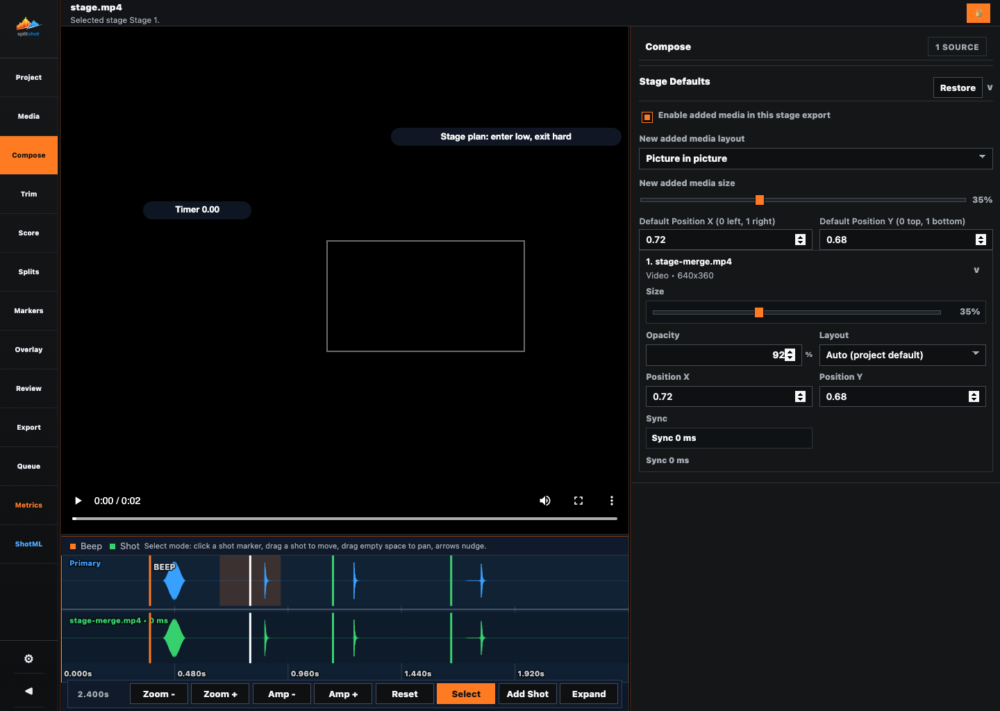

# Compose Pane

The Compose pane controls the active stage composition. It uses media already paired in Media and does not import new stage files.

## Use This Pane For

- Choosing how the active stage's added media is composed.
- Setting per-source layout, size, opacity, position, and sync.
- Enabling or disabling added media in the render for the active stage.
- Matching the live preview to the exported composition.

## Key Controls

| Control | What it does |
| --- | --- |
| `Enable added media export` | Includes added media in the rendered output. |
| `New added media layout` | Sets the default layout for newly attached added media on this stage. |
| `New added media size` | Sets the default inset size for newly attached added media on this stage. |
| `Default Position X` / `Default Position Y` | Set the default inset placement for newly attached added media on this stage. |
| Media card toggle | Expands or collapses a source row. |
| Per-item `Layout` | Sets the layout mode for that specific source. |
| Per-item `Size` | Sets the per-source inset size. |
| Per-item `Opacity` | Sets per-source transparency. |
| Per-item `Position X` / `Position Y` | Sets per-source normalized placement. |
| `Sync` | Shows and edits that source's saved sync offset. |

## Workflow

1. Pair media in [media.md](media.md) first.
2. Open Compose on the stage you want to edit.
3. Enable added-media export if the extra media should render.
4. Choose the stage defaults for newly attached added media.
5. Expand each source card and tune its per-source layout, size, opacity, position, and sync while watching the preview.
6. Open [trim.md](trim.md) when the active stage still needs sync or trim changes.

## Notes

- Compose edits are stage-local.
- Switching stages changes the entire composition context.
- Stage defaults live here for the active stage composition. Global defaults remain in Settings.
- Per-source overrides stay on that source. Changing stage defaults does not erase them.
- Add or replace stage files in Media. Compose works only with already attached sources.

## Related Guides

Previous: [media.md](media.md)
Next: [trim.md](trim.md)
