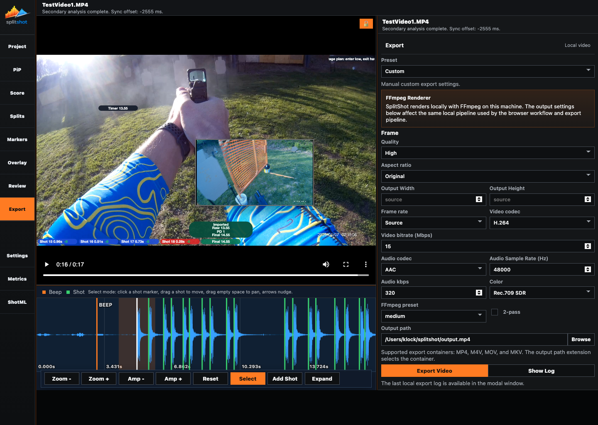
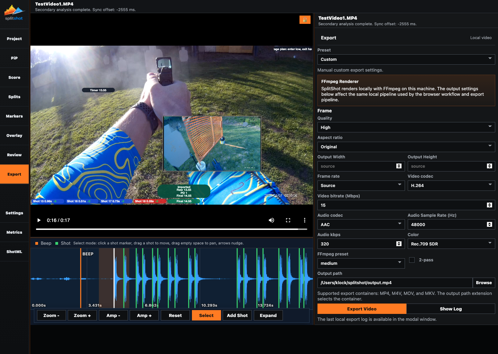
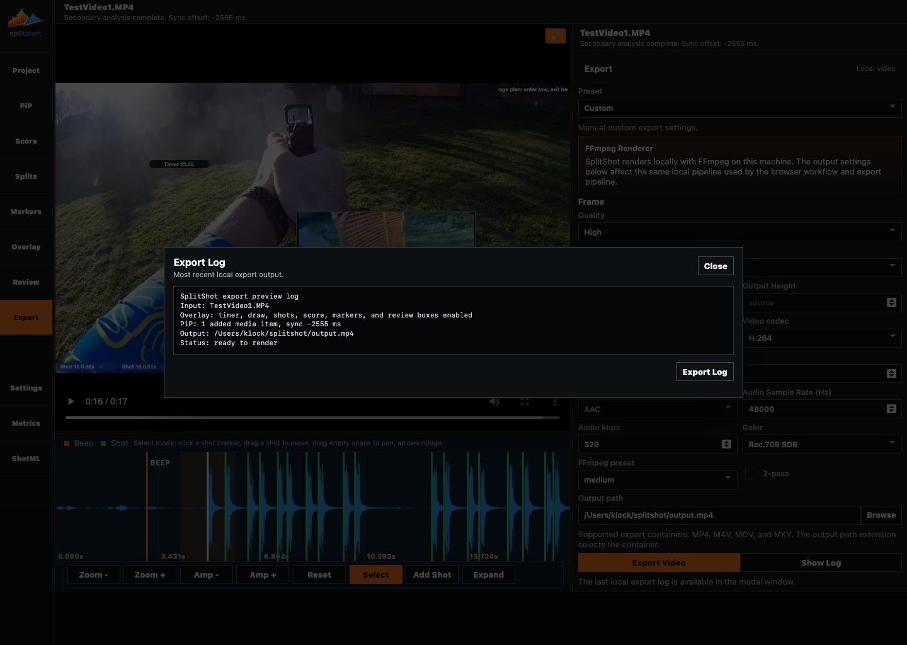

# Export Pane

The Export pane renders the finished video locally through FFmpeg. It uses the current timing, score, overlay, marker, review-box, and enabled PiP state at the moment you start the render.

## When To Use This Pane

- After timing, scoring, overlays, markers, review boxes, and PiP are final.
- When you need a draft or final render.
- When the output needs a specific aspect ratio, frame rate, codec, bitrate, or container.
- When you want to inspect the live FFmpeg log.

## Key Controls

| Control | What it does |
| --- | --- |
| `Preset` | Chooses a built-in export profile or `Custom`. |
| `Quality` | Sets the general quality target. |
| `Aspect ratio` | Keeps original framing or crops to a target shape such as `16:9`, `9:16`, `1:1`, or `4:5`. |
| `Output Width` / `Output Height` | Override output dimensions. Leave as `source` to follow source-derived size. |
| `Frame rate` | Uses source frame rate or a fixed target. |
| `Video codec` | Chooses the video encoder, such as H.264. |
| `Video bitrate (Mbps)` | Sets target video bitrate. |
| `Audio codec` | Chooses audio codec, currently AAC in the visible UI. |
| `Audio Sample Rate (Hz)` | Sets output audio sample rate. |
| `Audio kbps` | Sets output audio bitrate. |
| `Color` | Sets the color pipeline, currently Rec.709 SDR in the visible UI. |
| `FFmpeg preset` | Trades render speed against compression efficiency. |
| `2-pass` | Enables two-pass bitrate allocation at the cost of extra render time. |
| `Output path` | Sets the destination file. The extension selects the container. |
| `Browse` | Opens a save dialog for the output path. |
| `Export Video` | Starts the local render. |
| `Show Log` | Opens the live/latest export log. |
| Export Log modal | Shows recent local FFmpeg output and can export the log text. |

## How To Use It

1. Choose a `Preset`, or use `Custom` for exact settings.
2. Confirm aspect ratio and dimensions.
3. Use H.264 for broad compatibility unless you know the target supports another codec.
4. Set a sensible bitrate for draft versus final output.
5. Choose an output filename ending in `.mp4`, `.m4v`, `.mov`, or `.mkv`.
6. Click `Export Video`.
7. Click `Show Log` if you need to follow FFmpeg progress or diagnose a failed render.
8. Use `Export Log` inside the modal when you need the log as a separate text file.

## What The Export Includes

- Current primary video timing.
- Overlay badge layout and colors.
- Score summary and score-token colors.
- Enabled markers.
- Enabled review text boxes.
- Enabled PiP media.

## Common Fixes

| Problem | Fix |
| --- | --- |
| Export fails immediately. | Check output path, extension, and folder permissions. |
| FFmpeg is missing. | Install `ffmpeg` and `ffprobe`, then relaunch SplitShot. |
| PiP is missing from the output. | Turn on `Enable added media export` in [pip.md](pip.md). |
| Review boxes are missing. | Enable the box in [review.md](review.md). |
| Output is larger than expected. | Lower bitrate, use a slower FFmpeg preset, or choose a more appropriate preset. |

## Related Guides

Previous: [review.md](review.md)
Next: [settings.md](settings.md)

**Last updated:** 2026-04-23
**Referenced files last updated:** 2026-04-23
