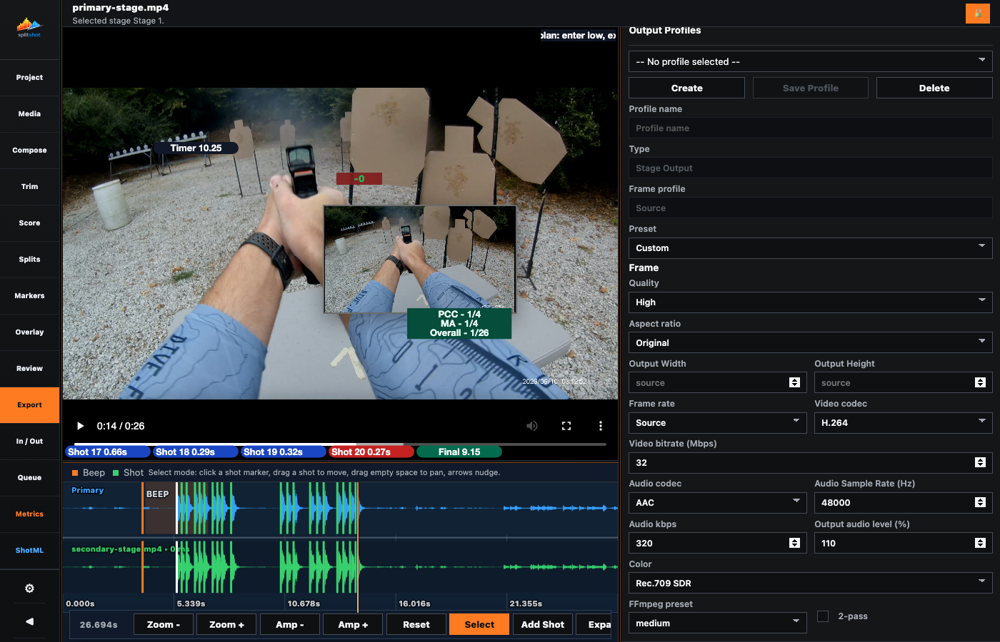
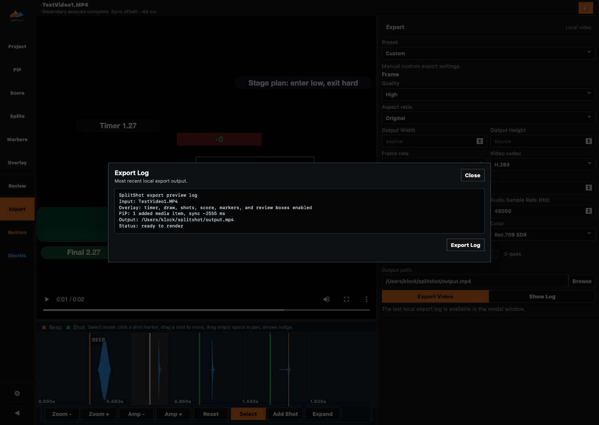

# Export Pane

The Export pane renders the finished video locally through FFmpeg. It uses the current timing, score, overlay, marker, review-box, and enabled added-media state at the moment you start the render.

<!-- markdownlint-disable MD033 -->

<!-- markdownlint-enable MD033 -->

## When To Use This Pane

- After timing, scoring, overlays, markers, review boxes, and added media are final.
- When you want a reusable output profile instead of one-off export settings.
- When you need a draft or final render.
- When the output needs a specific aspect ratio, frame rate, codec, bitrate, or container.
- When you want to inspect the live FFmpeg log.

## Key Controls

| Control | What it does |
| --- | --- |
| `Output Profiles` | Lists reusable stage-scoped output recipes for the active stage. Create, select, preview, duplicate, and delete profiles here. |
| `Update Profiles` | Reloads the current stage profile list. |
| `Run Padding` | Saves the extra lead-in / tail padding wrapped around the reviewed stage run for the selected output profile. It does not replace Stage timing review. |
| `Overlay Data` | Chooses which timing / score badges render into export while reusing the current overlay styling. |
| `Aspect Ratio / Framing` | Saves the profile-specific export framing (`Source`, `16:9`, `9:16`, `1:1`, or `4:5`) while width and height stay in the main `Frame` section. |
| `Opening Title` | Opens the reusable title-card editor. It can combine saved match/stage/shooter/division/classification/date details with optional custom title/subtitle text, animation mode, and a local logo file. |
| `Your Logo` | Opens the reusable branding editor. It can render text, image, or both with position, opacity, size, color, and duration. Set duration to `0` when it should stay visible for the full export. |
| `Save Hook` | Writes the active hook editor back to the selected output profile. |
| `Preset` | Chooses a built-in export profile or `Custom`. |
| `Quality` | Sets the general quality target. |
| `Aspect ratio` | Keeps original framing or crops to a target shape such as `16:9`, `9:16`, `1:1`, or `4:5`. |
| `Output Width` / `Output Height` | Override output dimensions. Leave as `source` to follow source-derived size. |
| `Frame rate` | Uses source frame rate or a fixed target. |
| `Video codec` | Chooses the video encoder, such as H.264. |
| `Video bitrate (Mbps)` | Sets target video bitrate. |
| `Audio codec` | Chooses audio codec, currently AAC in the visible UI. |
| `Audio Sample Rate (Hz)` | Sets output audio sample rate. |
| `Audio kbps` | Sets output audio bitrate. |
| `Color` | Sets the color pipeline, currently Rec.709 SDR in the visible UI. |
| `FFmpeg preset` | Trades render speed against compression efficiency. |
| `2-pass` | Enables two-pass bitrate allocation at the cost of extra render time. |
| `Output path` | Sets the destination file. The extension selects the container. |
| `Browse` | Opens a save dialog for the output path, starting from the project's `Output` folder when that path has not been changed yet. |
| `Export Video` | Starts the local render. |
| `Show Export Log` | Opens the live/latest export log. |
| Export Log modal | Shows recent local FFmpeg output and can export the log text. |

## How To Use It

1. Create or select an `Output Profile` first when you want reusable export settings instead of stage-only one-offs.
2. If the profile needs saved video/output adjustments, open the matching editor and click `Save Hook` before exporting.
   - `Run Padding`: save only the extra lead-in and tail padding that should wrap the reviewed run window for this profile.
   - `Overlay Data`: choose which Stage timing / score badges should render into export while keeping the current overlay styling.
   - `Aspect Ratio / Framing`: save the profile-specific framing (`Source`, `16:9`, `9:16`, `1:1`, or `4:5`).
3. Open `Opening Title` or `Your Logo` when the export needs finishing graphics.
   - `Opening Title`: choose a preset style, then enable the saved match/stage/shooter/division/classification/date fields you want in the title card. Add custom title/subtitle text, choose `Static`, `Fade`, or `Slide Up`, and optionally point the profile at a local logo image.
   - `Your Logo`: choose `SplitShot`, `Custom Text`, `Image`, or `Image + Text`, then set the rendered text, image file, text color, text size, position, opacity, and duration.
4. Choose a `Preset`, or use `Custom` for exact settings.
5. Confirm aspect ratio and dimensions.
6. Use H.264 for broad compatibility unless you know the target supports another codec.
7. Set a sensible bitrate for draft versus final output.
8. Choose an output filename ending in `.mp4`, `.m4v`, `.mov`, or `.mkv`.
9. Click `Export Video`.
10. Click `Show Export Log` if you need to follow FFmpeg progress or diagnose a failed render.
11. Use `Export Log` inside the modal when you need the log as a separate text file.

## What The Export Includes

- Current primary video timing.
- Overlay badge layout and colors.
- Score summary and score-token colors.
- Enabled markers.
- Enabled review text boxes.
- Enabled added media.
- Any saved `Run Padding`, `Overlay Data`, and `Aspect Ratio / Framing` values on the selected output profile.
- Any saved `Opening Title` intro-card composition, animation, and logo hook values plus `Your Logo` text/image/position/opacity hook values on the selected output profile.

## Common Fixes

| Problem | Fix |
| --- | --- |
| Export fails immediately. | Check output path, extension, and folder permissions. |
| FFmpeg is missing. | Install `ffmpeg` and `ffprobe`, then relaunch SplitShot. |
| The run starts or ends in the wrong place. | Fix the reviewed beep / last-shot timing in Stage editing first. `Run Padding` only adds extra lead-in and tail around that reviewed run. |
| Added media is missing from the output. | Turn on `Enable added media export` in [pip.md](pip.md). |
| Review boxes are missing. | Enable the box in [review.md](review.md). |
| Output is larger than expected. | Lower bitrate, use a slower FFmpeg preset, or choose a more appropriate preset. |
| `Save Hook` changed the wrong recipe. | Click the intended row in `Output Profiles`, then save again. |

## Related Guides

Previous: [review.md](review.md)
Next: [settings.md](settings.md)
<!-- export-pane-guide-eof -->
