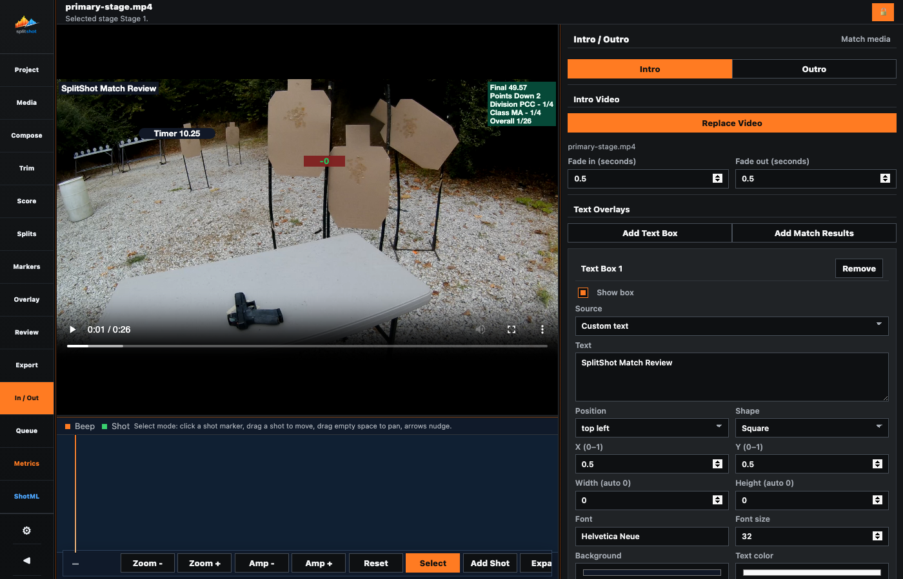

# Intro / Outro Pane

<!-- Documentation reviewed: 2026-08-11 -->

The `In / Out` sidebar item opens the Intro / Outro pane for optional match-opening and match-closing videos. In the packaged app, selection uses the native video picker; browser mode uses the local path picker. A successful selection is copied into the project `IntroOutro/` folder, shown in the main preview immediately, persisted with the project, and made available to Queue. Intro and Outro keep independent text overlay configurations.

Text boxes can be positioned with the controls or dragged directly in the video preview. Control edits update the preview immediately, save in order, and remain stable while the app refreshes project state.

Each clip has its own `Fade in (seconds)` and `Fade out (seconds)` controls, defaulting to `0.5`. A value of `0` disables that end. These fades apply to both video and audio when Queue prepares the clip, and overlong values are shortened proportionally so they do not overlap.

Intro and Outro previews use the selected clip's contained frame. Overlay size and position are calculated against that frame, and inspector changes preserve the current playback time.

Use the Intro and Outro buttons to switch which clip is shown in the main preview. `Add Text Box` creates custom copy. `Add Match Results` creates an automatically populated box whose selectable fields include the combined match result, raw time, stage and shot totals, points, penalties, competitor, division, class, and overall place.

These boxes use the same overlay data model and frame renderer as stage Review boxes, so color, opacity, typography, size, and placement are burned into the combined output as previewed. Queue first normalizes boundary media to the final output dimensions and then paints the text, so the selected font size and measured box are not scaled a second time. Match values are resolved again when Queue processes the file so late scoring changes are included.

Queue has separate `Include intro` and `Include outro` choices. A selected file is not part of individual stage outputs. In `Process as One File`, enabled clips are placed outside the stage sequence and receive the configured fade-in and fade-out.
