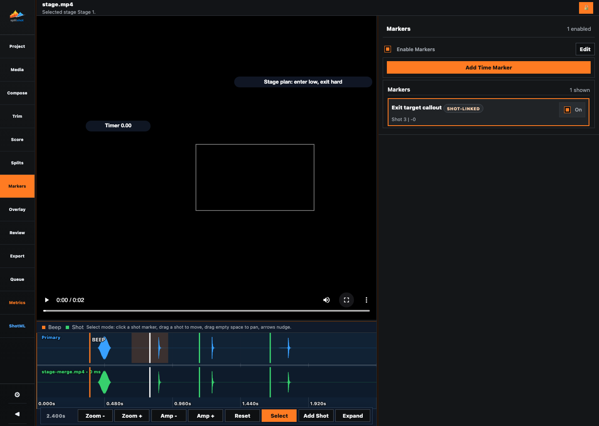
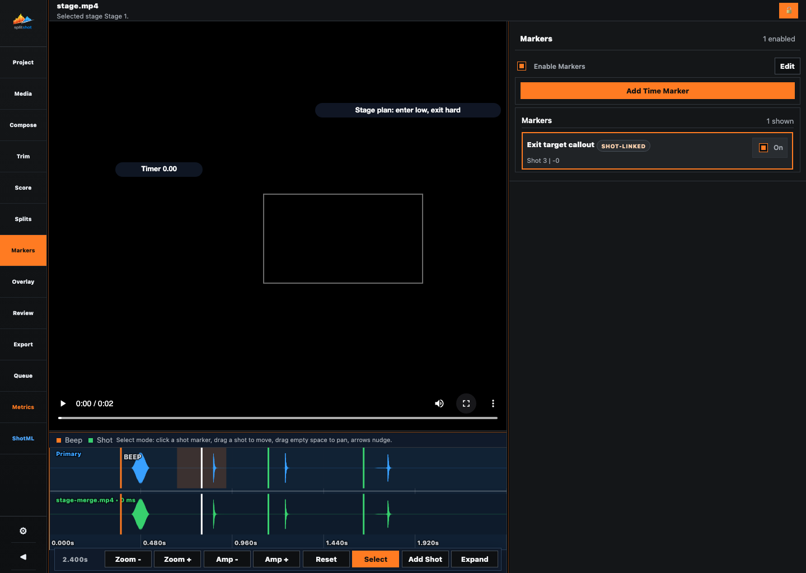

# Markers Pane

The Markers pane creates shot-linked and time-based text or image callouts for the active stage. Its compact inspector supports quick selection; Edit opens the full marker workbench.

## Compact Pane

The compact inspector shows:

- `Enable Markers`
- `Edit` when the marker editor is closed
- `Collapse` when the marker editor is open
- `Add Time Marker`
- the compact marker list

The selected-marker editor appears only while Edit mode is open.

## Edit Mode

Click `Edit` to open the bottom workbench. Its toolbar includes `Add Time Marker`, `Add Selected Shot`, and `Import Shots`; the right inspector shows the selected marker. Click `Collapse` to return to the compact workspace.

The selected-marker header contains the marker name, enabled checkbox, `Duplicate`, and `Remove`. Marker content, timing, placement, size, colors, opacity, and motion are stored per marker.

Marker image selection starts in the project's `Markers/` folder. An image selected elsewhere is copied into `Markers/` before SplitShot uses it; an image already there is used in place.

## Guided Motion

`Enable Motion` switches between a fixed marker and a guided motion path. When motion is enabled:

1. Place `Start` at the marker's position at the beginning of its duration.
2. Place `Finish` at its ending position.
3. Click `Generate` to trace visible motion. If tracking cannot lock on, SplitShot creates evenly spaced intermediate points.
4. Use `Add Detail` to split the largest remaining time gap with a hand-tuned point.
5. Use `Previous` and `Next` to move between `Start`, generated `Auto` points, hand-authored `Detail` points, and `Finish`.
6. Edit the selected point with X/Y or drag its orange circle in the video.
7. Use `Remove Detail` to delete the selected intermediate point, or `Clear path` to remove the path and turn motion off.

Only the selected motion point appears on the video while editing. The user-facing workflow does not expose the internal `motion_path` representation.

## Defaults

`Settings > Markers` controls the enabled state, content type, text source, duration, shot-split duration, dimensions, motion, background, text color, and opacity for newly created markers. Existing markers keep their own state.

## Related Guides

Previous: [splits.md](splits.md)
Next: [overlay.md](overlay.md)
