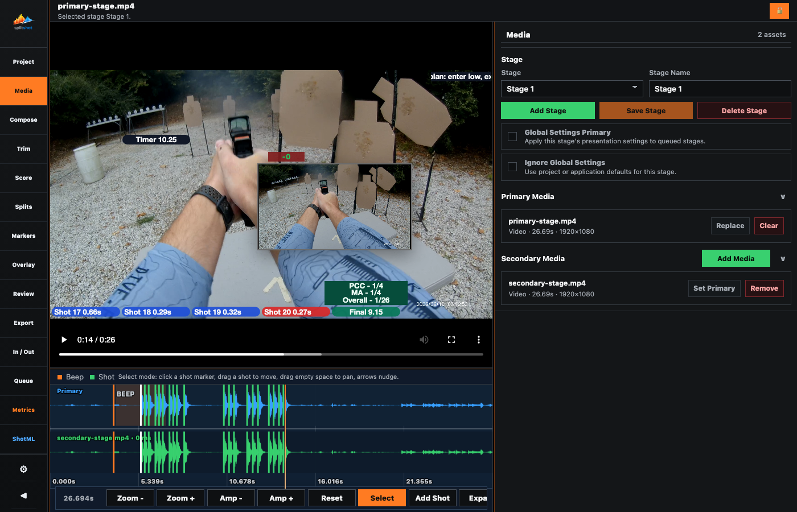

# Media Pane

<!-- Documentation reviewed: 2026-08-11 -->

The Media pane is the stage media workspace. It makes one stage active at a time, names that stage, and shows the primary and added media that belong to it.

## Use This Pane For

- Reviewing the active stage workspace and collapsing or expanding the file inventory.
- Selecting the active stage.
- Naming the active stage and saving that label.
- Viewing and managing file rows for primary and added media.
- Setting the primary video from any attached file.
- Adding more media files to a stage.
- Removing files from a stage.
- Creating or deleting stages.

## Key Controls

| Control | What it does |
| --- | --- |
| `Stage` | Chooses which stage is active across the rest of the app. |
| `Stage Name` | Renames the active stage. |
| `Save Stage` | Saves the current valid, changed stage label. Pressing Enter does the same. |
| `Delete Stage` | Removes the active stage. An imported stage stays deleted after autosave and reopen; explicitly reimporting the PractiScore file restores it. |
| File row | Shows one attached file with its filename, type, duration, and dimensions. |
| `Add Primary` / `Replace` | Opens in project `Input/`, imports the selected file there when needed, and replaces the active stage primary. |
| `Set Primary` | Promotes an added file into the primary slot. |
| `Remove` | Removes that file from the stage. |
| `Add Media` | Opens in project `Input/` and adds project-managed media to the active stage. |
| `Add Stage` | Creates another stage and makes it active. |
| `Global Settings Primary` checkbox | Uses this stage's Compose, Overlay, Review, marker-template, and Export presentation settings for other queued stages without replacing stage media, timing, or scoring data. Clearing it removes the designation without rewriting stages. |
| `Ignore Global Settings` checkbox | Excludes this stage from global presentation inheritance and restores project/application defaults. Clearing it resumes the current global source when one exists. |

## Workflow

1. Import PractiScore data in [project.md](project.md) first when stage records are available.
2. Open Media.
3. Choose the stage you want to work on.
4. Import a primary video for that stage.
5. Add more files with Add Media.
6. Set the primary designation on the file row you want.
7. Remove any files that do not belong.
8. Leave that stage selected so Compose, Trim, Score, Splits, Markers, Overlay, Review, Export, and Queue all use it.
9. Repeat for every stage in the project.
10. Move to [compose.md](compose.md) to configure the active stage composition.

## Notes

- One stage is active at a time across Compose, Trim, Score, Splits, Markers, Overlay, Review, Export, and Queue.
- Stage media is stage-local. Switching stages swaps the full editing context.
- Media temporarily locks its stage controls while a file picker/import is running so one import cannot be attached while another stage is being selected or created.
- Stage names must be unique.
- New manual and imported stages start from application defaults while retaining their own stage identity and imported scoring result.
- Competitor identity selectors live in Project, not here. Media owns stage selection, stage naming, and stage files.
- Files selected outside the project are copied into `Input/` before analysis. Files already in `Input/` are used directly.
- Removing a file row detaches it from the stage but does not delete the file from `Input/`.

## Related Guides

Previous: [project.md](project.md)
Next: [compose.md](compose.md)
