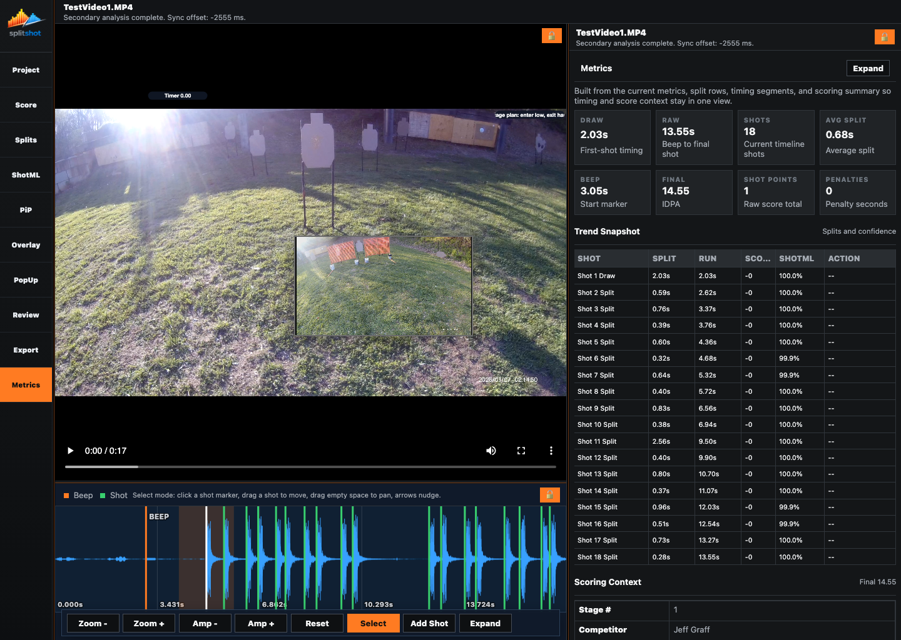
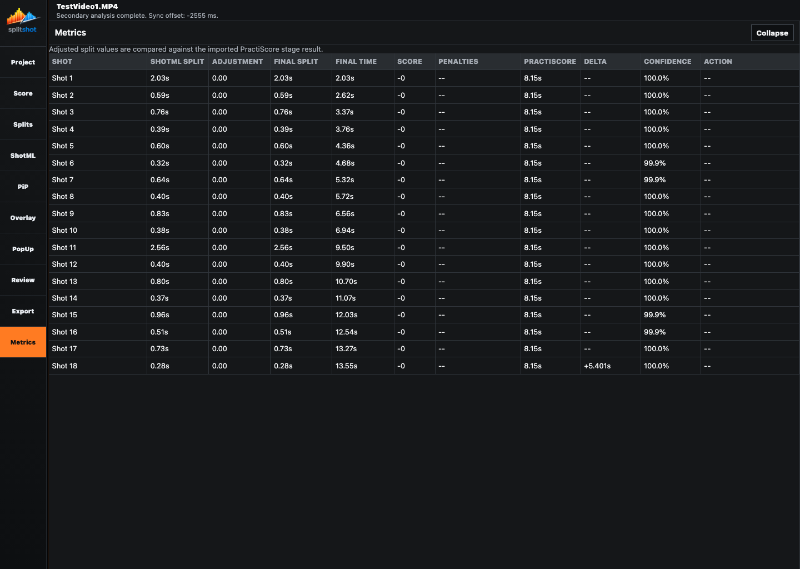
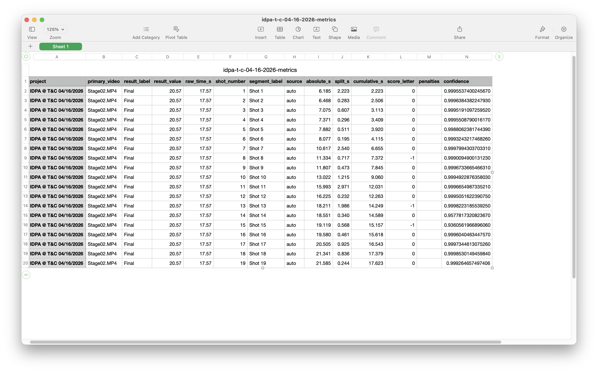

# Metrics Pane

The Metrics pane is a read-only dashboard for the current run. It summarizes timing, scoring, confidence, PractiScore comparison, and action context, then exports the same run data as CSV or plain text.

## When To Use This Pane

- After timing and scoring are stable.
- When you want a quick dashboard without editing anything.
- When you need a spreadsheet-friendly CSV.
- When you need a note-friendly text summary.
- When you want to compare SplitShot timing against imported PractiScore raw time.

## Key Controls

| Control | What it does |
| --- | --- |
| Summary cards | Show headline values such as draw, raw time, shot count, average split, beep, and result. |
| `Trend Snapshot` | Shows the compact row-by-row timing table in the inspector. |
| Scoring context block | Shows imported stage number, competitor, place, ruleset, result, raw/final timing, penalties, and points. |
| `Export CSV` | Downloads the current metrics table as CSV. |
| `Export Text` | Downloads a plain-text run summary. |
| `Expand` | Opens the full-width Metrics table. |
| `Collapse` | Returns from the expanded table to the normal workspace. |

## Expanded Table Columns

| Column | Meaning |
| --- | --- |
| `Shot` | Shot or event row label. |
| `ShotML Split` | Automatic detector split before manual adjustment. |
| `Adjustment` | Manual timing delta. |
| `Final Split` | Final split after edits. |
| `Final Time` | Final cumulative time. |
| `Score` | Current per-shot score text. |
| `Penalties` | Current penalty shorthand. |
| `PractiScore` | Imported official raw comparison value. |
| `Delta` | Difference against imported official timing when available. |
| `Confidence` | ShotML confidence or manual context. |
| `Action` | Draw, reload, malfunction, custom event, or other timing context. |

## How To Use It

1. Read the summary cards for draw, raw, shots, average split, beep, and result.
2. Review the `Trend Snapshot` table for the sequence story.
3. Check scoring context when you need stage, competitor, place, ruleset, penalty, or official comparison details.
4. Click `Expand` for the dense table view.
5. Click `Export CSV` for spreadsheet work.
6. Click `Export Text` for coaching notes, messages, or training logs.

## Read-Only Behavior

Metrics does not edit the project. It changes when the source data changes:

- Timing edits come from [splits.md](splits.md).
- Detector confidence and ShotML split context come from [shotml.md](shotml.md).
- Scores and penalties come from [score.md](score.md).
- Imported official context comes from [project.md](project.md).

## Common Fixes

| Problem | Fix |
| --- | --- |
| Metrics changed after timing edits. | That is expected. It follows the current split list. |
| Result changed after scoring. | That is expected. It follows the live scoring summary. |
| CSV is missing official comparison. | Import PractiScore in [project.md](project.md). |
| A row looks wrong but Metrics has no editor. | Fix the source pane: Splits for timing, Score for scoring, Project for imported context. |

## Related Guides

Previous: [export.md](export.md)
Next: [../workflow.md](../workflow.md)

**Last updated:** 2026-04-22
**Referenced files last updated:** 2026-04-22
