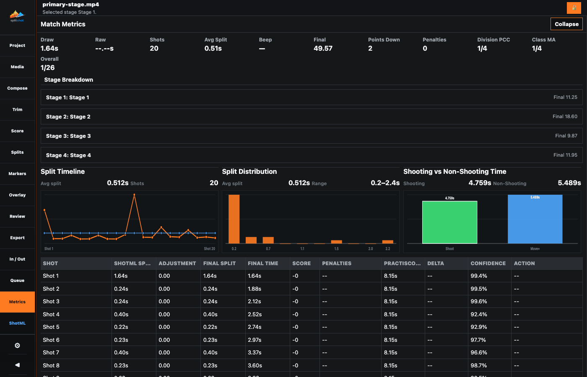

# Metrics Pane

The Metrics pane is the read-only post-stage dashboard for the current run. It keeps timing graphs, imported competitor-cohort comparisons, the expanded table, scoring context, and CSV/text exports aligned with the same data.

## When To Use This Pane

- After timing and scoring are stable.
- When you want a quick dashboard without editing anything.
- When you need a spreadsheet-friendly CSV.
- When you need a note-friendly text summary.
- When you want timing, placement, and pace context without editing anything.

## Key Controls

| Control | What it does |
| --- | --- |
| Match and Stage Stats | Shows combined match metrics first, followed by one summary row per stage. USPSA totals are labeled `Combined HF`, not official match scoring. |
| Summary cards | Show active-stage headline values such as draw, raw time, shot count, average split, beep, and result. |
| `Shot Breakdown` | Shows timing graphs plus imported Overall, sport-division, and sport-class cohort comparisons when enough source data is available. Division and class labels use the imported acronyms. |
| Compact timing table | Keeps the row-by-row snapshot in view. The columns are `Shot`, `Split`, `Run`, `Score`, `ShotML`, and `Action`. |
| Scoring context block | Shows imported `Stage #`, `Competitor`, and `Place` first, followed by ruleset, result, raw/final timing, penalties, and points. |
| `Export CSV` | Downloads match stats, per-stage summaries, and stage-identified detailed rows. |
| `Export Text` | Downloads match and stage summaries followed by active-stage detail. |
| `Expand` | Opens the full-width Metrics table. |
| `Collapse` | Returns from the expanded table to the normal workspace. |

## Expanded Table Columns

| Column | Meaning |
| --- | --- |
| `Shot` | Shot or event row label. |
| `ShotML Split` | Automatic detector split before manual adjustment. |
| `Adjustment` | Manual timing delta. |
| `Final Split` | Final split after edits. |
| `Final Time` | Final cumulative time. |
| `Score` | Current per-shot score text. |
| `Penalties` | Current penalty shorthand. |
| `PractiScore` | Imported official raw comparison value. |
| `Delta` | Difference against imported official timing when available. |
| `Confidence` | ShotML confidence or manual context. |
| `Action` | Draw, reload, malfunction, custom event, or other timing context. |

## How To Use It

1. Read `Match and Stage Stats` for the combined and per-stage view.
2. Read the active-stage summary cards for draw, raw, shots, average split, beep, and result.
3. Start with the compact `Split Timeline` to see split-by-split pace.
4. Use `Split Distribution` to spot interval outliers and hesitation points.
5. Use `Shooting vs Non-Shooting Time` to separate shooting cadence from movement and dead time.
6. Check the Overall, division-acronym, and class-acronym cohort comparisons when imported match data is available. These are three separate cohorts; there is no combined division-and-class cohort.
7. Review the compact timing table for the row-by-row details.
8. Check scoring context when you need stage, competitor, place, ruleset, penalty, or official comparison details. The context is a two-column table so long names wrap instead of clipping.
9. Click `Expand` for the dense table view.
10. Click `Export CSV` for spreadsheet work.
11. Click `Export Text` for coaching notes, messages, or training logs.

## Read-Only Behavior

Metrics does not edit the project. It changes when the source data changes:

- Timing edits come from [splits.md](splits.md).
- Detector confidence and ShotML split context come from [shotml.md](shotml.md).
- Scores and penalties come from [score.md](score.md).
- Imported official context comes from [project.md](project.md).

## Common Fixes

| Problem | Fix |
| --- | --- |
| Metrics changed after timing edits. | That is expected. It follows the current split list. |
| Result changed after scoring. | That is expected. It follows the live scoring summary. |
| CSV is missing official comparison. | Import PractiScore in [project.md](project.md). The graphs still render without it. |
| A row looks wrong but Metrics has no editor. | Fix the source pane: Splits for timing, Score for scoring, Project for imported context. |

## Related Guides

Previous: [queue.md](queue.md)
Next: [shotml.md](shotml.md)
