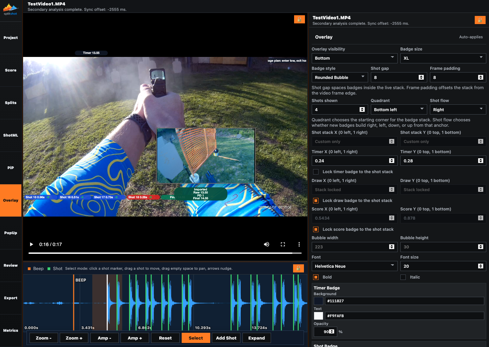
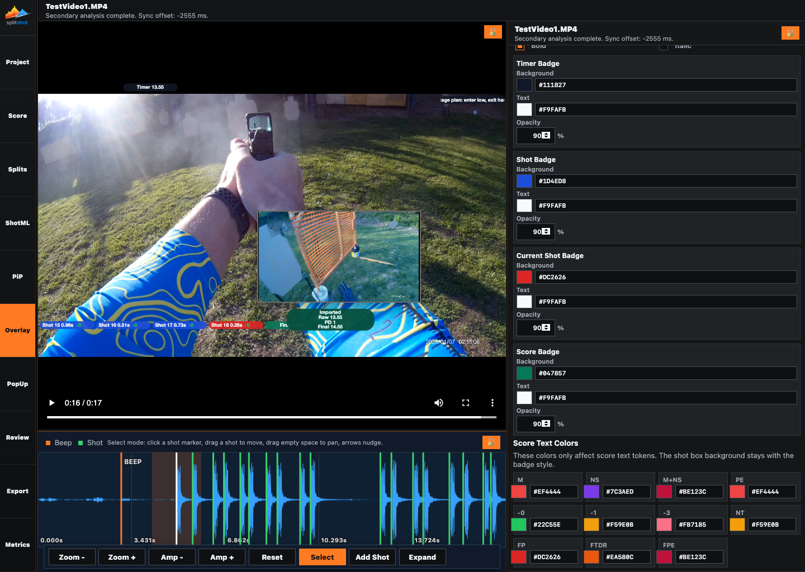

# Overlay Pane

The Overlay pane controls the badges and summary markers drawn over the video. Use it to decide how many shot badges stay visible, where the badge stack starts, how timer/draw/final badges anchor to that stack, and what colors, fonts, and badge styles the final presentation uses.

## When To Use This Pane

- After the shot list and score are mostly stable.
- When you want to change how shot badges stack and flow.
- When you want the timer, draw, or final score badge in a different place.
- When you want the exported overlay to match a specific visual style.

## Before You Start

- Finalize the first timing pass in [splits.md](splits.md).
- Enable scoring in [score.md](score.md) if you want a final score badge.
- Add PiP media first if the picture-in-picture layout changes where the overlay should live.

## Key Controls

| Control | What it does |
| --- | --- |
| `Overlay visibility` | Shows or hides the whole overlay and chooses the screen edge used for the default overlay band: `Hidden`, `Top`, `Bottom`, `Left`, or `Right`. |
| `Badge size` | Chooses the overall badge scale. |
| `Badge style` | Chooses `Square`, `Bubble`, or `Rounded Bubble`. |
| `Shot gap` | Sets the spacing between badges inside the live shot stack. |
| `Frame padding` | Sets how far the shot stack sits from the video edge. |
| `Shots shown` | Limits how many recent shot badges stay visible. |
| `Quadrant` | Chooses the starting anchor for the shot stack. |
| `Shot flow` | Chooses whether new badges build right, left, down, or up from that anchor. |
| `Shot stack X` and `Shot stack Y` | Set the custom stack position when `Quadrant` is `Custom`. |
| `Timer X` and `Timer Y` | Set a custom timer-badge position when timer lock is off. |
| `Lock timer badge to the shot stack` | Keeps the timer badge attached to the shot stack. |
| `Draw X` and `Draw Y` | Set a custom draw-badge position when draw lock is off. |
| `Lock draw badge to the shot stack` | Keeps the draw badge attached to the shot stack. |
| `Score X` and `Score Y` | Set a custom final-score position when score lock is off. |
| `Lock score badge to the shot stack` | Keeps the final score badge attached to the shot stack. |
| `Bubble width` and `Bubble height` | Force a fixed badge size. Leave them unset to let SplitShot auto-size the badges. |
| `Font` | Chooses the badge font family. |
| `Font size` | Sets the text size used inside the badges. |
| `Bold` and `Italic` | Change the badge text style. |
| Badge style cards | Set the background color, text color, and opacity for `Timer Badge`, `Shot Badge`, `Current Shot Badge`, and `Score Badge`. |
| `Score Text Colors` | Set the text colors used for score tokens such as `M`, `NS`, `-0`, `-1`, `PE`, or `FTDR`. |

## How To Use It

1. Set `Overlay visibility` first. Use `Hidden` when you want no badges in preview or export, or choose an edge when you want the overlay visible.
2. Pick `Badge size` and `Badge style` so the rest of the placement work uses the right visual scale.
3. Set `Shot gap`, `Frame padding`, and `Shots shown` to control how dense the shot stack feels.
4. Choose `Quadrant` and `Shot flow` for the basic stack direction.
5. Switch `Quadrant` to `Custom` when you need exact `Shot stack X` and `Shot stack Y` values.
6. Keep `Lock timer badge to the shot stack`, `Lock draw badge to the shot stack`, and `Lock score badge to the shot stack` on if you want those badges to travel with the shot stack.
7. Turn a lock off when a badge needs its own custom `X` and `Y` position.
8. Leave `Bubble width` and `Bubble height` unset when you want SplitShot to size the badges automatically for the longest badge text in the current project.
9. Finish by choosing the font, text styling, badge colors, and score text colors while watching the live preview.

## Live Preview Expectations

- Overlay changes auto-apply while you work.
- The preview keeps overlay badges above the browser's native video controls so drag targets do not sit under the control bar.
- `Custom` shot-stack coordinates only apply when `Quadrant` is set to `Custom`.
- `Stack locked` means the badge is currently following the shot stack instead of using independent coordinates.
- Score text colors only change the score tokens inside the badge. They do not replace the badge background color.

## How It Affects The Rest Of SplitShot

- Review text boxes can lock themselves to the same overlay stack.
- Export uses the same badge layout, colors, font settings, and score-token colors you configure here.
- Score determines whether the final score badge has a result to show.

## Common Mistakes And Fixes

| Problem | Fix |
| --- | --- |
| No badges appear in preview. | Set `Overlay visibility` to an edge instead of `Hidden`, then confirm the relevant Review visibility toggles are on. |
| `Shot stack X` and `Shot stack Y` are not doing anything. | Set `Quadrant` to `Custom` first. |
| A timer, draw, or score badge will not move. | Turn off the matching lock-to-stack checkbox. |
| The score text color changed but the badge background did not. | That is expected. `Score Text Colors` only affect the text tokens. |
| The badge stack covers too much of the subject. | Reduce `Shots shown`, change `Quadrant`, or move the stack with custom X and Y. |
| Preview and export look slightly different. | Recheck the current Overlay, Review, and PiP settings before exporting. Export uses the same settings, but the final render is still a separate local pass. |

## Related Guides

Previous: [pip.md](pip.md)
Next: [review.md](review.md)

**Last updated:** 2026-04-21
**Referenced files last updated:** 2026-04-21
