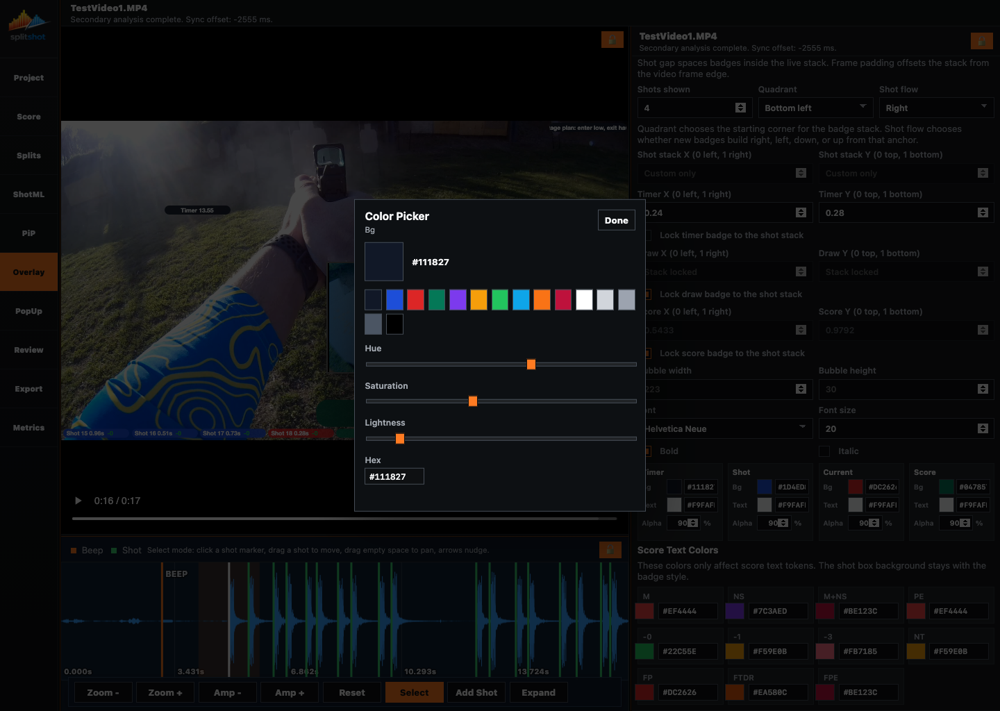

# Overlay Pane

The Overlay pane controls the badges drawn over the video: timer, draw, shot stack, current shot, and final score. It also owns badge placement, typography, colors, score-token colors, and stack behavior.

## When To Use This Pane

- After timing and scoring are close to final.
- When badge placement covers the subject.
- When timer, draw, split, or final score badges need different visibility.
- When the final export needs a specific visual style.

## Key Controls

| Control | What it does |
| --- | --- |
| `Overlay visibility` | Chooses whether the overlay is hidden or anchored to an edge. |
| `Badge size` | Sets global badge scale. |
| `Badge style` | Chooses the badge shape. |
| `Shot gap` | Sets spacing inside the shot stack. |
| `Frame padding` | Offsets badges from the video frame edge. |
| `Shots shown` | Limits how many recent shot badges stay visible. |
| `Quadrant` | Sets the shot-stack anchor. |
| `Shot flow` | Sets whether shot badges build right, left, down, or up. |
| `Shot stack X` / `Shot stack Y` | Custom stack coordinates when `Quadrant` is custom. |
| `Timer X/Y`, `Draw X/Y`, `Score X/Y` | Independent badge coordinates when the matching lock is off. |
| Lock checkboxes | Keep timer, draw, or score badges attached to the shot stack. Dragging a locked badge moves the whole locked stack. |
| `Bubble width` / `Bubble height` | Force badge dimensions; leave unset for auto-sizing. |
| `Font`, `Font size`, `Bold`, `Italic` | Control badge typography. |
| Badge style cards | Compact side-by-side cards for timer, shot, current shot, and score badge background, text color, and opacity. |
| Score text color controls | Set colors for score tokens such as `-0`, `-1`, `M`, `NS`, `PE`, and similar values. |
| Color swatches | Open the shared color picker modal with quick swatches, hue, saturation, lightness, and hex input. |

## How To Use It

1. Set `Overlay visibility` so badges appear in preview.
2. Choose `Badge size` and `Badge style`.
3. Set `Shots shown`, `Quadrant`, and `Shot flow` to get the stack into the right part of the frame.
4. Leave timer/draw/score locks on when those badges should travel with the shot stack.
5. Turn a lock off when that badge needs its own X/Y placement.
6. Drag a locked timer, draw, or score badge when you want to reposition the whole locked stack directly in preview.
7. Tune bubble dimensions and typography.
8. Finish with the compact badge style cards and score text colors while watching the preview.
9. Click a color swatch when you need the expanded color picker instead of typing a hex value directly.

## Preview And Export Behavior

- Overlay edits auto-apply.
- Review visibility toggles can hide individual badge types without changing the underlying style.
- Export uses the same overlay style and placement you see in preview.
- Score text colors affect the text token, not the badge background.
- The same color picker modal is used by Overlay, PopUp, and Review color swatches.

## Common Fixes

| Problem | Fix |
| --- | --- |
| No badges appear. | Set `Overlay visibility` to an edge and confirm Review toggles are on. |
| X/Y fields are disabled. | Choose `Custom` placement or turn off the matching lock. |
| A badge follows the shot stack when you wanted direct placement. | Turn off that badge's lock checkbox. |
| The stack covers the target. | Reduce `Shots shown`, change `Quadrant`, or use custom stack coordinates. |
| Export does not match the intended overlay. | Recheck Overlay, Review, and PiP before clicking `Export Video`. |

## Related Guides

Previous: [pip.md](pip.md)
Next: [popup.md](popup.md)

**Last updated:** 2026-04-23
**Referenced files last updated:** 2026-04-23
