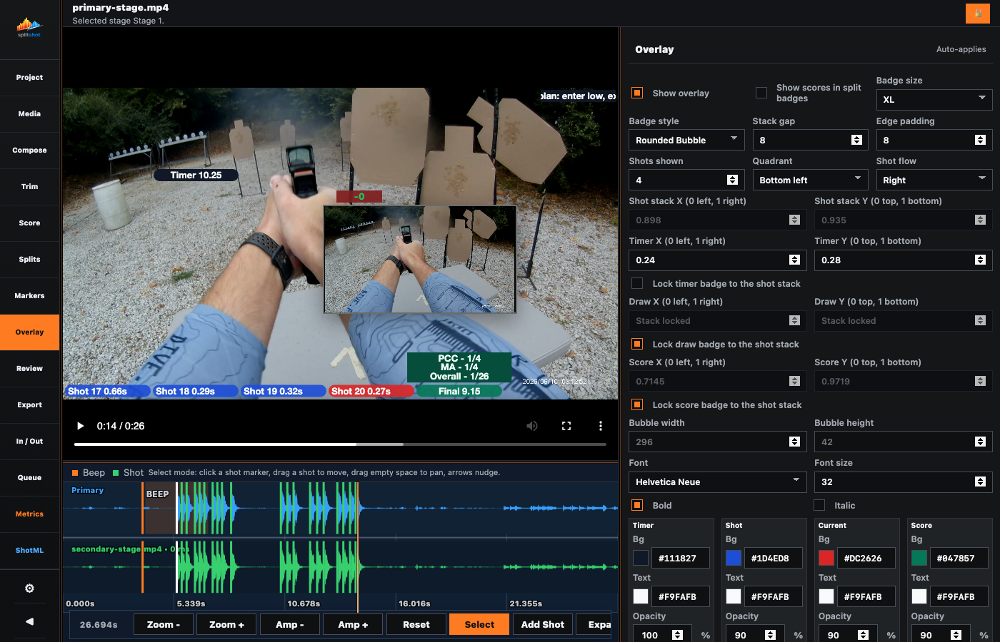
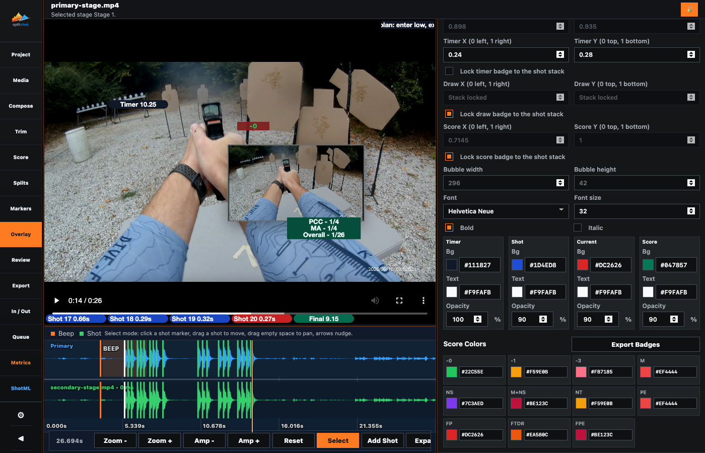
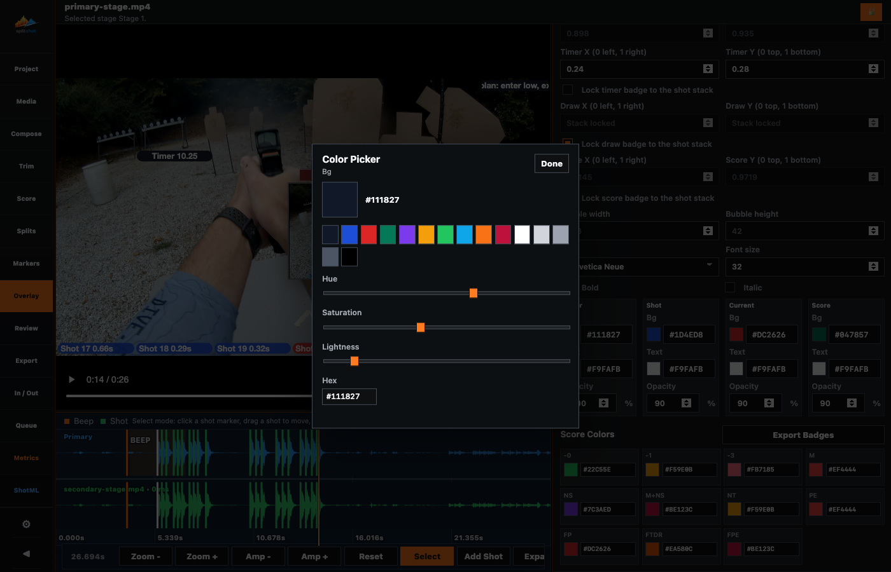

# Overlay Pane

<!-- Documentation reviewed: 2026-08-11 -->

The Overlay pane controls the badges drawn over the video: timer, draw, shot stack, current shot, and final score. It owns badge placement, typography, score-token colors, and the live visual style used in preview and export.

<!-- markdownlint-disable MD033 -->

<!-- markdownlint-enable MD033 -->

## When To Use This Pane

- After timing and scoring are close to final.
- When badge placement covers the subject.
- When timer, draw, split, or final score badges need different visibility.
- When the final export needs a specific visual style.

## Key Controls

| Control | What it does |
| --- | --- |
| `Show overlay` | Toggles the live overlay badges on or off in preview. |
| `Badge size` | Sets the preset badge scale. Choose `Custom` when you want to keep manual font sizing instead of using the preset scale. |
| `Badge style` | Chooses the badge shape. |
| `Stack gap` | Sets spacing inside the shot stack. |
| `Edge padding` | Offsets badges from the video frame edge. |
| `Shots shown` | Limits how many recent shot badges stay visible. |
| `Quadrant` | Sets the shot-stack anchor. |
| `Shot flow` | Sets whether shot badges build right, left, down, or up. |
| `Shot stack X` / `Shot stack Y` | Custom stack coordinates when `Quadrant` is custom. |
| `Timer X/Y`, `Draw X/Y`, `Score X/Y` | Independent badge coordinates when the matching lock is off. |
| Lock checkboxes | Keep timer, draw, or score badges attached to the shot stack. Dragging a locked badge moves the whole locked stack. |
| `Bubble width` / `Bubble height` | Force badge dimensions; leave unset for auto-sizing. |
| `Font`, `Font size`, `Bold`, `Italic` | Control badge typography. `Font size` becomes the exact sizing control when `Badge size` is `Custom`. |
| Badge style cards | Compact side-by-side cards for timer, shot, current shot, and score badge background, text color, and opacity. |
| `Score Colors` | Sets colors for score tokens such as `-0`, `-1`, `M`, `NS`, `PE`, and similar values. |
| `Export Badges` | Saves the current overlay badge state (styles, scoring colors, visibility toggles, locks, typography) as a preset on the active output profile's `metric_caption_preset` field. |
| Color swatches | Open the shared color picker modal with quick swatches, hue, saturation, lightness, and hex input. |

## How To Use It

1. Turn on `Show overlay` so badges appear in preview.
2. Choose `Badge size` and `Badge style`.
3. If the presets feel close but not exact, switch `Badge size` to `Custom` and tune `Font size` directly.
4. Set `Shots shown`, `Quadrant`, and `Shot flow` to get the stack into the right part of the frame.
5. Leave timer/draw/score locks on when those badges should travel with the shot stack.
6. Turn a lock off when that badge needs its own X/Y placement.
7. Drag a locked timer, draw, or score badge when you want to reposition the whole locked stack directly in preview.
8. Tune `Stack gap`, `Edge padding`, bubble dimensions, and typography.
9. Finish with the compact badge style cards and `Score Colors` while watching the preview.
10. Click `Export Badges` to save the current badge configuration to the active output profile. The preset is stored in that profile's `metric_caption_preset` field and reapplied when the profile is loaded.
11. Click a color swatch when you need the expanded color picker instead of typing a hex value directly.

## Preview And Export Behavior

- Overlay edits auto-apply.
- Review visibility toggles can hide individual badge types without changing the underlying style.
- Export uses the same overlay style and placement you see in preview.
- Score text colors affect the text token, not the badge background.
- The same color picker modal is used by Overlay, Markers, and Review color swatches.

## Common Fixes

| Problem | Fix |
| --- | --- |
| No badges appear. | Turn on `Show overlay` and confirm Review toggles are on. |
| X/Y fields are disabled. | Choose `Custom` placement or turn off the matching lock. |
| A badge follows the shot stack when you wanted direct placement. | Turn off that badge's lock checkbox. |
| The stack covers the target. | Reduce `Shots shown`, change `Quadrant`, or use custom stack coordinates. |
| Export does not match the intended overlay. | Recheck Overlay, Review, and Compose, then process again from `Queue`. |

## Frame Profile

The frame profile selected in an Output Profile (Export pane) overrides the export aspect ratio. When exporting with a profile that has a frame profile set (such as `16:9`, `9:16`, `1:1`, or `4:5`), the output is cropped to that ratio. Set the frame profile to `Source` to use the export pane's aspect ratio.

## Export Badges

Click `Export Badges` in the Overlay pane to save the current badge configuration — styles, scoring colors, visibility toggles, lock states, and typography — to the active output profile. The preset is stored in the profile's `metric_caption_preset` field and persists with the profile in `profiles.json`. Load a profile to restore its badge preset; changes are saved through `/api/output-profiles/update`.

## Related Guides

Previous: [markers.md](markers.md)
Next: [review.md](review.md)
