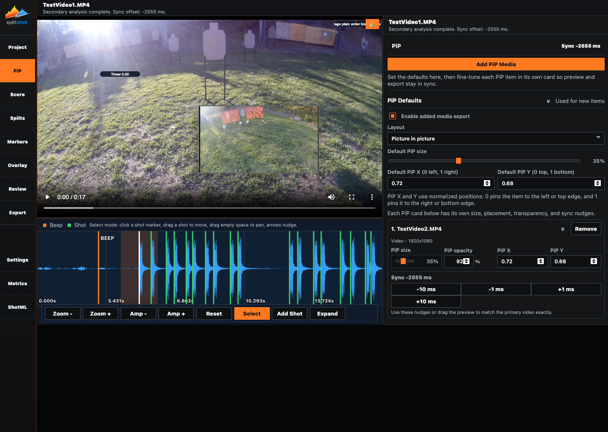

# PiP Pane

The PiP pane manages extra media that should appear alongside the primary run. Use it to add videos or images, choose the layout, set default PiP behavior for new items, then fine-tune size, position, and sync on each media card.

## When To Use This Pane

- When you want a second angle in the final export.
- When you want still images or graphics in the composition.
- When you need to offset a secondary video so it lines up with the primary timeline.
- When you want to test picture-in-picture, side-by-side, or above/below layouts before export.

## Before You Start

- Import the primary video first.
- Finish the first timing pass before doing detailed sync work.
- Keep extra media on a local drive and remember that only enabled PiP media renders into the export.

## Key Controls

| Control | What it does |
| --- | --- |
| `Add PiP Media` | Adds one or more extra files. SplitShot accepts both videos and images here. |
| Per-item title row | Shows the media order, filename, and `Remove` action for that item. |
| Media type line | Shows whether the item is a video or image, plus its dimensions when available. |
| Per-item `PiP size` | Sets the size of that specific item. |
| Per-item `PiP X` and `PiP Y` | Set that item's normalized position, where `0` is left or top and `1` is right or bottom. |
| Per-item `Sync` label | Shows the current offset for that item in milliseconds. |
| Per-item `-10 ms`, `-1 ms`, `+1 ms`, `+10 ms` | Nudges that item's sync earlier or later. |
| `Enable added media export` | Includes the PiP media in the rendered export. |
| `Layout` | Chooses `Side by side`, `Above / below`, or `Picture in picture`. |
| `Default PiP size` | Sets the default size used for newly added items. |
| `Default PiP X` and `Default PiP Y` | Set the default normalized placement used for newly added items. |
| PiP defaults section | Stays expanded so default size and placement are visible before and after adding media. |

## How To Use It

1. Click `Add PiP Media` and choose every extra file you want in the project.
2. Turn on `Enable added media export` when you want those items in the final render.
3. Choose the layout that matches the finished look you want.
4. Treat the default size and default X/Y fields as setup values for new items only.
5. Use each media card to set the real `PiP size`, `PiP X`, `PiP Y`, and `Sync` for that specific item.
6. Use the sync nudge buttons until the secondary motion lines up with the primary video.
7. In PiP layout, drag the preview item on the stage when you want to refine the visible position directly.

## Multiple Items And Layout Behavior

- Every added file gets its own numbered card.
- The first added media card opens expanded by default so its size, position, and sync controls are immediately available.
- Videos and images can coexist in the same project.
- Each item keeps its own size, position, and sync values.
- Default PiP values do not retroactively move existing items.
- `Picture in picture` is the strongest live preview mode because you can see the inset placement directly.
- `Side by side` and `Above / below` still use the same saved media list and sync values, but they are layout-wide compositions instead of floating insets.

## Comparing Angles

The current PiP pane does not expose a dedicated swap-or-compare button. Compare angles by watching the live preview, adjusting the per-item cards, and removing or repositioning items as needed.

## How It Affects The Rest Of SplitShot

- The stage preview shows the active PiP composition while you work.
- Export includes only the PiP media that are still present and enabled.
- Per-item sync values stay saved with the project bundle so you do not need to rebuild the layout every session.

## Common Mistakes And Fixes

| Problem | Fix |
| --- | --- |
| The extra media look correct in preview but are missing from the render. | Turn on `Enable added media export`. |
| Changing the default PiP size did not move older cards. | Edit the per-item card. Defaults affect only new items. |
| You cannot find the default PiP controls. | Reopen the PiP defaults section; it is intended to stay visible at the top of the pane. |
| A secondary video is visibly late or early. | Use the per-item sync nudges until the motion matches the primary video. |
| A still image does not need timing but still shows sync controls. | That is normal. Position and size still matter, while sync mainly matters for video items. |
| You expected a swap-angle button. | The current pane uses per-item cards and live preview instead of a dedicated swap control. |

## Related Guides

Previous: [score.md](score.md)
Next: [overlay.md](overlay.md)

**Last updated:** 2026-04-21
**Referenced files last updated:** 2026-04-21
