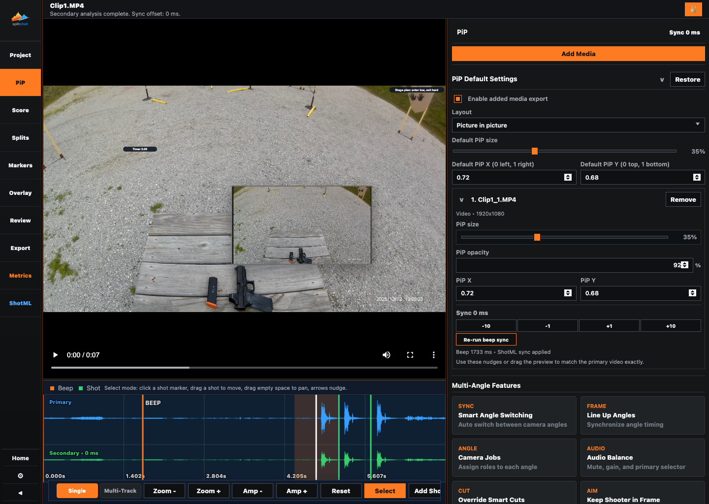

<!-- markdownlint-disable MD012 -->

# Compose Pane

The Compose pane manages added media on a per-item basis. The defaults at the top only seed new cards. Each added media card keeps its own `Trim Video`, `Camera role`, `Placement`, layer size, opacity, sync offset, and, when free placement is active, X/Y position.

<!-- markdownlint-disable MD033 -->

<!-- markdownlint-enable MD033 -->

## When To Use This Pane

- Add follow, static, detail, or replacement primary support media.
- Add a still image, support graphic, or extra video angle.
- Trim an added clip without changing the original file.
- Place one added item over the primary video or over another added item.
- Sync each added item against the primary run.
- Decide whether the added-media composition should render into the final export.

## Key Controls

| Control | What it does |
| --- | --- |
| `Add Media` | Opens the local chooser for one video or image at a time. Repeat it for each added item. |
| `Enable added media export` | Turns the added-media composition on for preview and export. When it is off, the cards stay editable but the composed result is not active. |
| `New item layout` | Seeds new cards with `Side by side`, `Above / below`, `Picture in picture`, `Full-screen portrait`, `Dual center HUD`, or `Dual top HUD`. Existing cards keep their own placement state. |
| `New item layer size` | Sets the starting layer size for newly added media. |
| `New item layer X` / `New item layer Y` | Set the starting normalized X/Y position for newly added cards when free placement is active. |
| `Trim Settings` | Opens the selected output profile's reusable lead-in and tail padding defaults. Each card's `Trim Video` flow uses these values. |
| Media card `>` / `v` | Expands or collapses per-item controls. |
| `Remove` | Deletes that added media item. |
| Per-item `Trim Video` | Sets start/end bounds for that item, can capture from the current frame, and creates or refreshes a project-local derivative in `Input/`. The original source stays untouched. |
| Per-item `Camera role` | Tags that item as `Primary`, `Follow`, `Static`, or `Detail` so cards stay organized. |
| Per-item `Placement mode` | Chooses whether that item behaves as a base, docked panel, or overlay. |
| Per-item `Placement slot` | Chooses the side, band, center, or overlay slot for the current placement mode. |
| Per-item `Overlay target` / `Base item` | For `Picture in picture` and `Full-screen portrait`, choose whether the item sits over the primary video or another added media card. |
| Per-item `Layer size` | Sets one item's floating-layer size. |
| `Layer opacity` | Sets one item's transparency. |
| Per-item `Layer X` / `Layer Y` | Set one item's normalized placement when the card is in a free-placement `Picture in picture` overlay slot. |
| `Sync` and nudge buttons | Move that item's sync offset by milliseconds. `Analyze beep sync` can set it automatically when the added clip has a detectable start beep. |

## How To Use It

1. Click `Add Media`, choose one local video or image, then repeat `Add Media` for each additional item.
2. Set the top defaults if several upcoming cards should start from the same layout, size, or X/Y seed values.
3. Turn on `Enable added media export` when the composed result should stay active.
4. Expand a card and set its `Camera role`.
5. Use that card's `Placement` section to decide whether it should be a base, a docked panel, or a `Picture in picture` / portrait overlay. When needed, choose `Overlay target` and `Base item`.
6. If the selected output profile needs different reusable trim padding, open `Trim Settings` and save the lead-in and tail values there.
7. Use each card's `Trim Video` section to set the actual clip bounds for that item. `Trim Video` writes or refreshes a local derivative in the project `Input/` folder.
8. Use the sync nudge buttons or `Analyze beep sync` until the added item lines up with the primary video.
9. Only `Picture in picture` with the `Overlay` slot keeps free X/Y placement active and supports preview dragging. Docked placements stay snapped to their slot.

## Layout Notes

- The top defaults do not rewrite existing cards. Each card is the saved composition truth for that item.
- `Base item` fills its target frame. `Side by side`, `Above / below`, and the two HUD layouts dock the item automatically into their panel.
- `Picture in picture` with slot `Overlay` keeps `Layer size`, `Layer X`, and `Layer Y` active and allows preview dragging.
- `Picture in picture` with `Left`, `Right`, `Top`, `Bottom`, or `Center` stays docked. Those slots use size, not free drag.
- `Full-screen portrait` centers the item inside a tall portrait frame over the primary video or the selected base item.
- `Trim Settings` changes reusable output-profile padding defaults. The real clip trim still lives inside each card's `Trim Video` section.
- `Trim Video` stores derivatives in the project `Input/` folder. Re-trimming overwrites the local derivative only.
- Preview placement and export rendering come from the same per-item card state; Compose is not limited to a single stage-wide layout switch.

## Common Fixes

| Problem | Fix |
| --- | --- |
| Added media appears in preview but not export. | Turn on `Enable added media export`. |
| I need to add several files. | Use `Add Media` repeatedly. The current chooser adds one item per selection. |
| Changing defaults did not move an existing card. | Edit the expanded media card. |
| I need a shorter clip but I do not want to edit the original file. | Use that card's `Trim Video` section. SplitShot writes a local derivative into `Input/` and leaves the source file alone. |
| It is hard to tell which added source is for what. | Expand that card and set its `Camera role` to `Primary`, `Follow`, `Static`, or `Detail`. |
| A secondary video is late or early. | Use that card's sync nudge buttons or `Analyze beep sync`. |
| The inset is in the wrong place. | Put the card in `Picture in picture` with slot `Overlay`, then adjust X/Y or drag the preview. Docked slots do not use free dragging. |
| I want one added card on top of another one. | Use `Placement mode` plus `Overlay target` / `Base item` on the card that should sit on top. |
| A still image shows sync and placement controls. | That is normal. Sync matters mostly for video, but placement, opacity, and export inclusion still matter for images. |

## Related Guides

Previous: [score.md](score.md)
Next: [overlay.md](overlay.md) <!-- pip-pane-guide-eof -->

