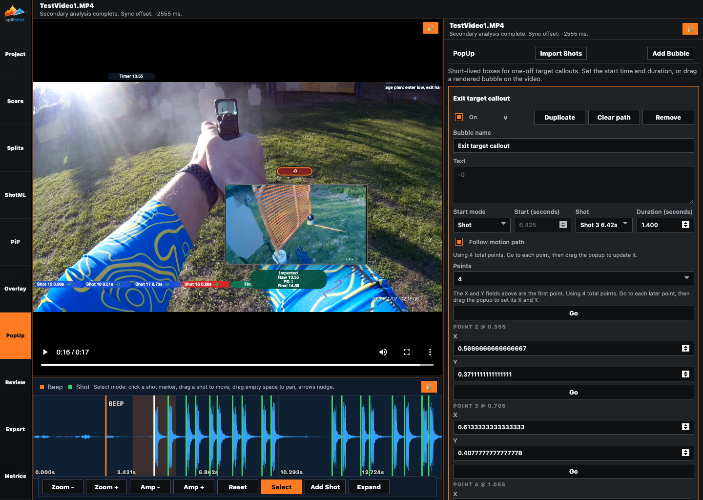
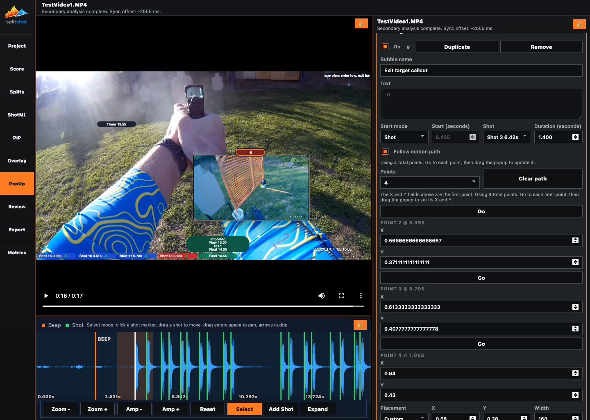

# Markers Pane

The Markers pane creates short-lived callouts on top of the video. A marker can be tied to a shot, tied to a timestamp, show text, show an image, show both, and optionally move along a motion path during its visible window.

## When To Use This Pane

- After shot timing is stable.
- After scoring, when you want score or penalty callouts.
- When one target transition or stage moment needs a visible annotation.
- When every shot should receive a score-linked marker.

## Key Controls

| Control | What it does |
| --- | --- |
| `Expand` | Opens the full Markers workspace with a fixed large video, the marker navigator on the right, and the selected-marker editor docked underneath. |
| `Open Workbench` | Opens the selected marker in the expanded right-rail plus lower-dock Markers workspace. |
| Compact marker toolbar | Keeps `Add Time Marker`, `Add Selected Shot`, `Import Visible Shots`, `Filter`, `Previous`, `Next`, `Play Window`, and `Loop` close to the right-side marker list while the editor stays underneath the video. |
| `Import Visible Shots` | Creates or refreshes one shot-linked marker for every currently shown shot. |
| `Selected Marker` summary | Shows the current marker state and keeps the primary workbench action in one predictable place. |
| `Add Time Marker` | Adds a time-based marker at the playhead. Marker creation is toolbar-only; clicking the video does not create new markers. |
| `Collapse` | Closes the expanded Markers workbench and returns to the compact pane. |
| `Import` | Chooses whether `Import Visible Shots` targets all shown shots, scored shots, or penalty/miss shots. Existing manual time markers are preserved. |
| `Filter` | Narrows the marker list to all, enabled, disabled, shot-linked, time-based, motion, missing text, or currently visible markers. The right-side list and lower editor stay in sync. |
| `Previous` / `Next` | Selects and seeks to the previous or next marker in the current filter. |
| `Play Window` | Plays the selected marker's exact visible window and stops at the end. |
| `Loop` | Loops the selected marker's exact visible window until the loop is stopped. |
| Marker list | Shows the current shot-linked and time-based markers in the lower dock beneath the video so selection stays close to the frame, just like the waveform shot list. |
| Workbench editor | Shows one fully expanded marker editor in the right pane so all marker manipulation happens beside the video instead of underneath it. |
| Marker title button | Selects the marker and seeks the video to its start. |
| Card chevron | Selects the marker, seeks the video to its start, and expands or collapses the editor. |
| `On` | Enables or disables the marker. |
| `Clear path` | Removes stored motion keyframes from the expanded motion editor. |
| `Duplicate` / `Remove` | Live in the marker editor so list rows stay focused on selection. |
| `Bubble name` | Sets the card title. |
| `Text` | Sets manual text for time-based markers. Shot-linked text can still follow Score. |
| `Content` | Chooses `Text`, `Image`, or `Text + Image`. |
| `Image path` / `Browse` | Chooses a local image for the marker. Saved projects copy that image into the bundle automatically. |
| `Scale` | Chooses `Contain` or `Cover` for image rendering. |
| `Start mode` | Chooses `Time` or `Shot`. |
| `Start (seconds)` | Sets a time-based start. Disabled for shot-linked markers. |
| `Shot` | Chooses the shot anchor for shot-linked markers. |
| `Duration (seconds)` | Controls how long the marker stays visible. |
| `Follow motion path` | Enables manual motion editing with the keyframe list and on-video path dots. |
| `Auto Trace Motion` | Samples the loaded video, locks onto nearby high-contrast detail, and generates a starter motion path for the selected marker. |
| `Add Keyframe` | Inserts a keyframe at the current playhead. |
| `Previous Keyframe` / `Next Keyframe` | Jumps between stored keyframes. |
| `Copy Prev Motion` | Reuses the previous visible shot-linked marker motion path on the selected marker. |
| `Apply To Shown Shot Popups` | Copies the selected marker's motion path to the currently shown shot-linked markers. |
| Motion keyframe list | Edits offset, easing, X, and Y for each stored keyframe. |
| On-video keyframe dots | Select and move the base point or later path dots directly on the video. |
| `X`, `Y` | Set direct normalized placement for the marker base point. |
| `Width`, `Height` | Force marker size. |
| `Bg`, `Text`, `Background alpha` | Style the bubble with the same compact swatch/hex controls used in Overlay. Alpha only affects the bubble background. |
| Color swatches | Open the shared color picker modal shown in [overlay.md](overlay.md). |
| Video-frame lock icon | Unlocks or relocks the shared layout resize controls. The waveform and inspector no longer duplicate this icon. |

## Shot-Linked Text

Shot-linked markers use the live Score pane values:

- IDPA-style scores resolve as values like `-0`, `-1`, or `-3`.
- USPSA/IPSC-style scores resolve as values like `A`, `C`, `D`, `M`, or `NS`.
- Per-shot penalties are appended using the visible scoring shorthand.
- Rescoring a shot updates that marker in preview and export.
- When a short shot-linked marker is selected for base placement, SplitShot shows a compact centered selector circle so you can drag the anchor cleanly without changing the saved marker style.

## How To Use It

1. Confirm timing in [splits.md](splits.md).
2. Score the run in [score.md](score.md) if shot-linked marker text should follow shot scores.
3. Click `Add Time Marker` for one free-timed callout, or `Import Visible Shots` for one shot-linked marker per shown shot.
4. Use `Import` before `Import Visible Shots` when you only want scored or penalty/miss callouts.
5. Use `Filter`, the lower marker list, or the `Previous` / `Next` controls to find the marker you want.
6. Use `Open Workbench` or `Expand` when you want the fixed-video editing layout with the selected-marker editor on the right and the marker list underneath.
7. Use `Play Window` or `Loop` to verify exactly what appears during that marker's visible window.
8. Leave `Content` open for the most common edits, then expand `Timing`, `Motion`, or `Style` only when you need them.
9. Choose `Shot` or `Time` start behavior.
10. Set `Duration` inside that marker editor.
11. Adjust `X` and `Y`, or drag the rendered marker on the video, when the bubble needs an exact position.
12. Expand `Motion`, then click `Auto Trace Motion` when you want SplitShot to generate a starter path from the loaded video automatically.
13. Enable `Follow motion path` when the callout should keep manual motion editing enabled.
14. Scrub the playhead, click `Add Keyframe`, then drag the on-video dots to place the base point and later keyframes directly on the frame.
15. Use the keyframe list for exact offset, easing, X, and Y edits. `Clear path` removes the stored motion path.
16. Tune size, colors, and opacity against the live preview.
17. Use a color swatch when you want the expanded picker with quick swatches and HSL/hex controls.

## Common Fixes

| Problem | Fix |
| --- | --- |
| `Text` is disabled. | The marker is shot-linked and text is coming from Score. Edit the shot score instead, or switch content/text source. |
| The marker appears at the wrong time. | Check `Start mode`, `Shot`, and `Duration`. |
| The bubble does not move. | Use `Auto Trace Motion` for a starter path, or turn on `Follow motion path`, add at least one later keyframe, and place it on the video. |
| `Auto Trace Motion` says it could not trace motion. | Move the base point onto a sharper, higher-contrast detail in the frame, then run `Auto Trace Motion` again. |
| The image is missing after reopening. | Save the project after choosing the image so SplitShot can bundle it into the project folder. |
| A marker is missing from export. | Confirm the marker is `On`, still points to a valid image if it uses one, and is visible during the exported time range. |

## Related Guides

Previous: [overlay.md](overlay.md)
Next: [review.md](review.md)

**Last updated:** 2026-04-30
**Referenced files last updated:** 2026-04-30
