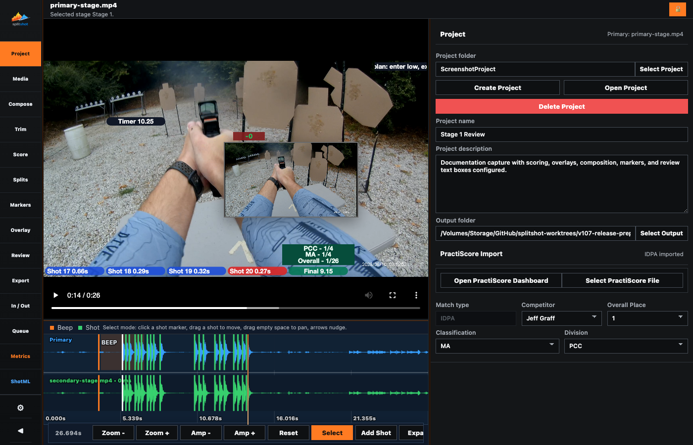

# Project Pane

The Project pane is the setup surface for a SplitShot run. It chooses the project folder, stores project details, stages PractiScore context from a local CSV/TXT export, offers a quick browser shortcut to PractiScore, and imports the primary video.

Once a project is active, SplitShot keeps later workflow controls in their working panes: reusable output profiles and hooks live in [export.md](export.md), review-source selection lives in [review.md](review.md), and added-media angle-role/source-management controls live in [pip.md](pip.md). The Project pane stays focused on setup.

## When To Use This Pane

- Start a new run.
- Establish the project folder that owns the run metadata, `CSV`, `Output`, and any local derivatives kept under `Input`.
- Load or replace the primary stage video.
- Open PractiScore in your browser when you need to log in or download results.
- Import official stage context from a local PractiScore CSV or TXT file.
- Create, select, or delete the saved project metadata for a bundle.

## Key Controls

| Control | What it does |
| --- | --- |
| `Project folder` | Shows the current project folder name. Before a project exists it stays blank and prompts you to create or select one. |
| `Select Project` | Opens an existing project bundle or adopts a folder for the current run, then keeps you on the Project pane so setup can continue immediately. |
| `Create Project` | Clears the current session, saves a new project into the selected folder, and keeps you on the Project pane for the next setup steps. |
| `Delete Project` | Removes only `project.json`, resets the current session, and leaves the project folders and files on disk. |
| `Project name` | Sets the saved name shown in the app and metrics/export filenames. |
| `Project description` | Stores project notes, stage reminders, or edit plans. |
| `PractiScore Import` | Groups the browser shortcut, local file import, and staged match-context controls while showing whether stage data is imported. |
| `Open PractiScore Dashboard` | Opens `https://practiscore.com/dashboard/home` in your system browser so you can log in or download results. Disabled until a project is active. |
| `Select PractiScore File` | Imports a local PractiScore CSV/TXT file as the active staged source. Disabled until a project is active. |
| `Match type` | Chooses the scoring family for the staged file, such as IDPA, USPSA, or Steel Challenge. |
| `Stage #` | Selects the stage from the imported match file. |
| `Competitor name` | Selects the competitor record from the staged data. |
| `Place` | Selects the matching place entry when duplicate competitor rows exist. `Competitor name` and `Place` stay synchronized. |
| Imported summary rows | Show source file, match type, official raw time, SplitShot raw time, raw delta, final value, and official final value. |
| `Primary Video` | Shows the current imported primary video's filename. Readonly; use `Import Primary Video` to choose or replace the file. Disabled until a project is active. |
| `Import Primary Video` | Opens the source-video picker, keeps the chosen file at its current path, and re-runs local analysis. Disabled until a project is active. |

## How To Use It

1. Click `Create Project` or `Select Project` first. The PractiScore and primary-video buttons stay disabled until a project is active, and SplitShot keeps you on the Project pane right after the project switch so you can keep setting things up.
2. Enter `Project name` and `Project description` before deeper editing so screenshots, exports, and metrics have meaningful labels.
3. If you need a PractiScore export, click `Open PractiScore Dashboard`, use your browser to download the relevant CSV/TXT result, then return to SplitShot.
4. Click `Select PractiScore File` and choose the exported CSV/TXT file.
5. Confirm `Match type`, `Stage #`, `Competitor name`, and `Place`.
6. When a competitor name is unique, selecting it also selects the matching `Place`. Selecting a duplicate `Place` backfills the matching competitor row.
7. Click `Import Primary Video` and choose the file. When SplitShot has no stronger last-used media path to reuse, the picker opens from the active project folder.
8. Wait for local analysis to finish. `Primary Video` updates to the imported file name, and the waveform, shot list, metrics, score rows, and overlays depend on that analysis.
9. Continue into [pip.md](pip.md), [review.md](review.md), and [export.md](export.md) for Compose source roles and sync, review-source selection, reusable output recipes, and export hooks.
10. Use `Create Project` for a clean session and `Delete Project` when the saved metadata should be removed without deleting the folder contents.

## Downstream Effects

- Primary video import keeps the selected source at its original path, then creates the waveform, detected shots, beep marker, and timing rows.
- PractiScore context from the imported local CSV/TXT file feeds Score, Review summary boxes, Overlay final results, Export, and Metrics.
- PractiScore file imports are staged inside the project's `CSV` folder.
- Once a project is active, later browse dialogs start from that project folder by default when no stronger existing path is available, including primary-video import.
- Export defaults point at the project's `Output/output.mp4` path unless you override them.
- Replacing the primary video resets media-bound state such as timing, added media, and export logs.
- The project folder is the persistent home for the current bundle.

## Common Fixes

| Problem | Fix |
| --- | --- |
| `Primary Video` still shows the old file name. | Use `Import Primary Video` again and choose the replacement file. |
| You already know where the primary video lives on disk. | Click `Import Primary Video` and select it from that folder. |
| PractiScore dashboard does not open. | Click `Open PractiScore Dashboard` again. If your browser blocks the launch, open `https://practiscore.com/dashboard/home` manually. |
| The imported result is for the wrong run. | Click `Select PractiScore File` again with the correct CSV/TXT export. |
| The imported stage is right but the competitor row is wrong. | Recheck `Match type`, `Stage #`, `Competitor name`, and `Place`. |
| `Save Hook` changed the wrong recipe. | Open [export.md](export.md), click the intended row in `Output Profiles`, then save again. |
| Review should follow a saved recipe instead of the live stage. | Open [review.md](review.md), pick that profile under `Review Source`, then click `Set Source`. |
| A previous project reopened unexpectedly. | Confirm the `Project folder` before using `Select Project`, then review the Settings pane if you want a different landing pane after a later reload. |
| The app looks empty after `Create Project`. | Import a primary video again. |

## Related Guides

See [../USER_GUIDE.md](../USER_GUIDE.md) for the broader guide, then continue to [pip.md](pip.md), [review.md](review.md), [export.md](export.md), or [shotml.md](shotml.md).
<!-- project-pane-guide -->
<!-- project-pane-guide-eof -->
<!-- project-pane-guide-end -->
