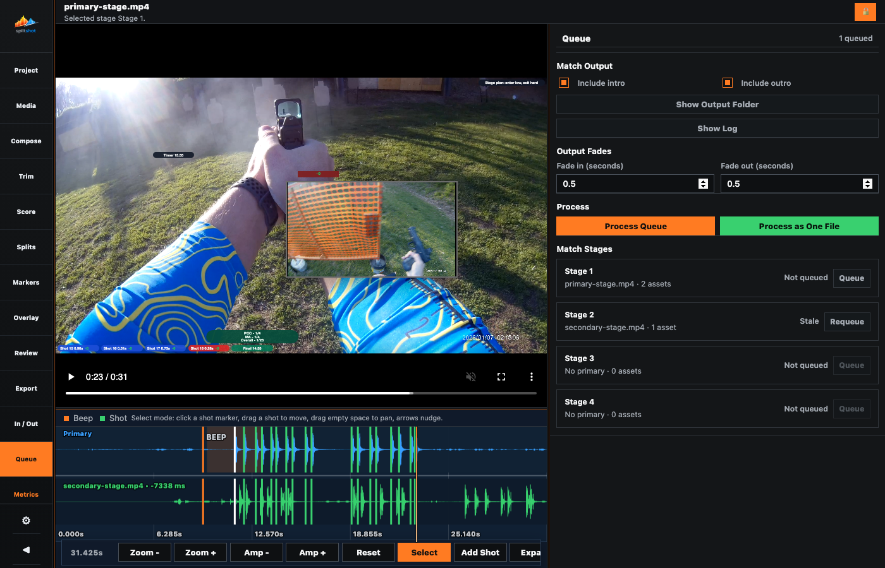
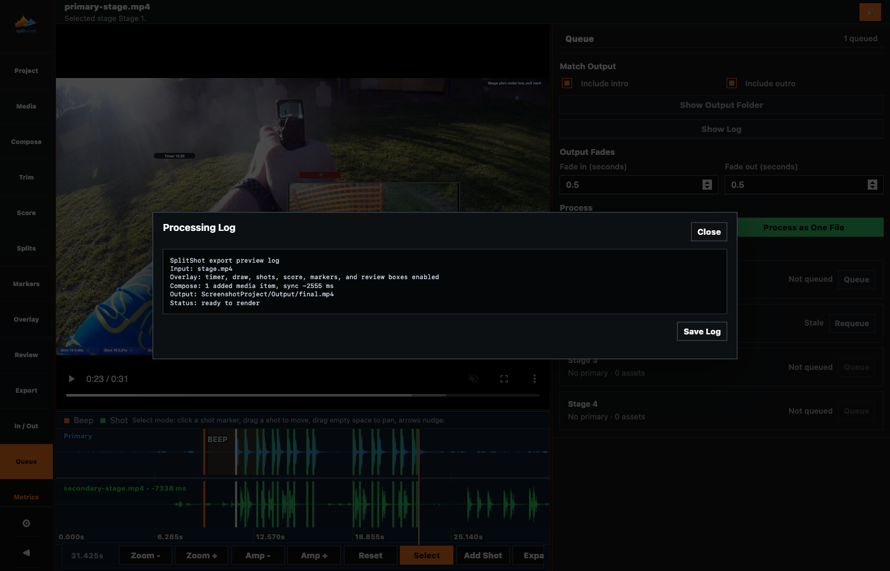

# Queue Pane

<!-- Documentation reviewed: 2026-08-11 -->

The Queue pane is the multi-stage export surface. It shows every loaded match stage, manages queue membership, and processes individual or combined outputs.

## Use This Pane For

- Reviewing queue status across stages.
- Reviewing every loaded stage and its queue status without changing the active editing stage.
- Including the configured intro or outro in a combined output.
- Processing individual outputs or a combined output.

## Key Controls

| Control | What it does |
| --- | --- |
| `Queue` / `Requeue` | Queues that row's stage using its current settings. |
| `Unqueue` | Removes that row's stage from the queue. |
| Match stage row | Shows one loaded stage, media summary, queue status, and membership action. |
| `Include intro` / `Include outro` | Adds the selected Intro / Outro clip at the outer edge of a combined output. |
| `Fade in` / `Fade out` | Sets project-level video and audio fades in 0.1-second steps. `0` disables that boundary. |
| `Show Output Folder` | Opens the configured project output directory. |
| `Show Log` | Opens the live processing log for the current or latest Queue run. Its label stays static while progress is reported inside the log dialog and status bar. |
| `Process Queue` | Exports one output file per queued stage. |
| `Process as One File` | Renders all queued stages and enabled boundary clips, then concatenates them into one file. |

## Status Meanings

| Status | Meaning |
| --- | --- |
| `Not Queued` | The stage is not queued. |
| `Queued` | The stage is ready to process. |
| `Processing` | The stage is currently exporting. |
| `Complete` | The stage finished processing. |
| `Failed` | The last queue attempt failed. |
| `Needs requeue` | The stage was queued, then changed and should be queued again. |

## Workflow

1. Configure one stage fully.
2. Click `Queue` on every match-stage row to include.
3. Configure optional boundary media in [intro-outro.md](intro-outro.md), then enable `Include intro` and/or `Include outro` if needed.
4. Click `Process Queue` for one file per stage, or `Process as One File` for a stitched output.

## Notes

- Queue does not replace Media and does not change the active editing stage.
- Queue executes the ffmpeg settings saved in Export; changing settings in Export does not render a file until Queue processing starts.
- Queue rows always point back to the underlying stage, not a detached export preset.
- Queue rows are compact and always visible; they do not have a collapsed state.
- Queue processing preserves queue order for combined output.
- Presentation edits made on a stage waterfall to later, unedited stages. A directly edited later stage keeps its own configuration. Stage timing, scoring, and Review Summary values always remain stage-specific.
- Queue output is WYSIWYG with the video preview: enabled overlay badges, Review boxes, metric selections, styles, sizes, and positions are rendered into the file.
- The green processing bar tracks the whole queue and reaches 100% only after every stage has been attempted and any combined file has been faded and validated.
- Queue progress refreshes four times per second. An open log dialog continues following the live run and switches to the complete persisted log when processing finishes.
- Individual mode fades each stage output. One-file mode fades only the outer boundaries of the combined file. Short clips automatically scale overlapping fade requests.

## Related Guides

Previous: [export.md](export.md)
Next: [metrics.md](metrics.md)
