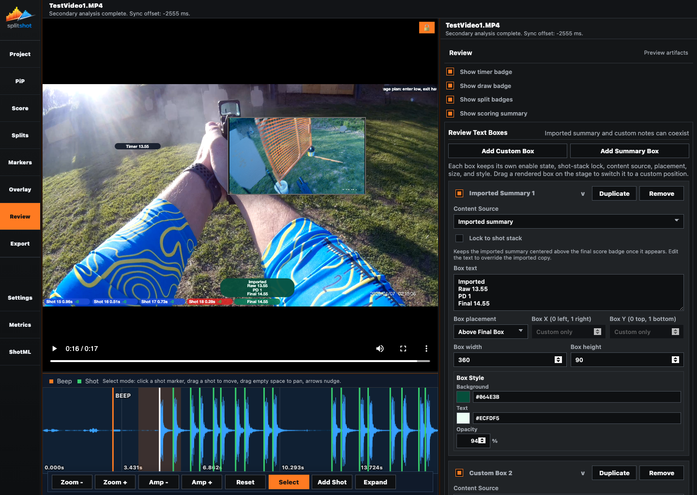
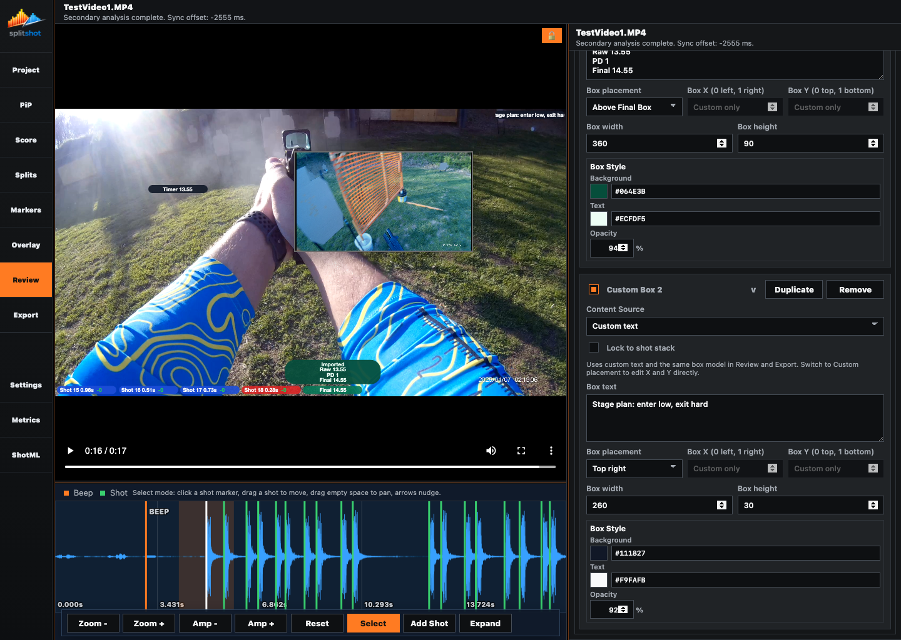

# Review Pane

The Review pane controls preview/export artifact visibility and text boxes. It is where you decide which overlay badges remain visible, add imported summary boxes, add custom note boxes, and tune each box's placement, size, color, and opacity.

## When To Use This Pane

- After Overlay placement is close to final.
- When you need to hide or show timer, draw, split, or scoring badges.
- When you want an imported PractiScore summary after the final shot.
- When you need a custom text note or stage-plan callout.

## Key Controls

| Control | What it does |
| --- | --- |
| `Show timer badge` | Shows or hides the timer badge. |
| `Show draw badge` | Shows or hides the draw badge. |
| `Show split badges` | Shows or hides the shot badge stack. |
| `Show scoring summary` | Shows or hides the final result badge. |
| `Add Custom Box` | Adds a manually typed text box. |
| `Add Summary Box` | Adds a PractiScore-backed summary box. |
| Box enable checkbox | Turns one text box on or off. |
| `>` / `v` | Expands or collapses that box editor. |
| `Duplicate` | Copies the box and its styling. |
| `Remove` | Deletes the box. |
| Video-frame lock icon | Unlocks or relocks the shared layout resize controls. The inspector header no longer duplicates this icon. |
| `Content Source` | Chooses `Custom text` or `Imported summary`. |
| `Lock to shot stack` | Makes the box follow the overlay shot stack instead of independent placement. |
| `Box text` | Edits the text for custom boxes. Imported summaries can be overridden here. |
| `Box placement` | Chooses `Above Final Box`, a fixed anchor, or `Custom`. |
| `Box X` / `Box Y` | Set direct normalized placement when custom placement is available. |
| `Box width` / `Box height` | Force text-box dimensions. |
| `Background`, `Text`, `Opacity` | Style the rendered box. |
| Color swatches | Open the shared color picker modal shown in [overlay.md](overlay.md). |

## How To Use It

1. Scrub near the final shot so summary behavior is visible.
2. Toggle the four badge visibility checkboxes to match the preview/export you want.
3. Use `Add Summary Box` for imported PractiScore summary text.
4. Use `Add Custom Box` for a typed note, title, or stage plan.
5. Pick `Content Source` on each card.
6. Expand or collapse cards with `>` / `v`; the pane preserves the clicked card position so the inspector does not jump vertically.
7. Use `Above Final Box` for a summary that should sit above the final result badge.
8. Use `Custom` placement plus X/Y, or drag the rendered box in the video, when the box needs an exact location.
9. When `Lock to shot stack` is on, dragging that rendered box moves the whole locked stack and keeps the box locked.
10. Adjust width, height, colors, and opacity until the text reads clearly over the footage.
11. Use a color swatch when you want the expanded picker with quick swatches and HSL/hex controls.

## Summary Box Behavior

- Imported summary boxes use PractiScore content when available.
- `Above Final Box` keeps a summary aligned with the final score/result badge.
- Locked boxes keep the same spacing relationship as the shot stack. Drag any locked item to reposition the stack as a group.
- Custom boxes stay visible according to their own enable state and placement.
- Enabled review boxes render into export.

## Common Fixes

| Problem | Fix |
| --- | --- |
| The imported summary is empty. | Import PractiScore in [project.md](project.md). |
| X/Y fields are disabled. | Use `Custom` placement and turn off `Lock to shot stack`. |
| A box moved after overlay changes. | That is expected when `Lock to shot stack` is on. |
| A box is missing from export. | Confirm the box enable checkbox is on. |
| A badge is hidden even though Overlay is configured. | Recheck the Review visibility toggles. |

## Related Guides

Previous: [popup.md](popup.md) (Markers)
Next: [export.md](export.md)

**Last updated:** 2026-04-23
**Referenced files last updated:** 2026-04-23
