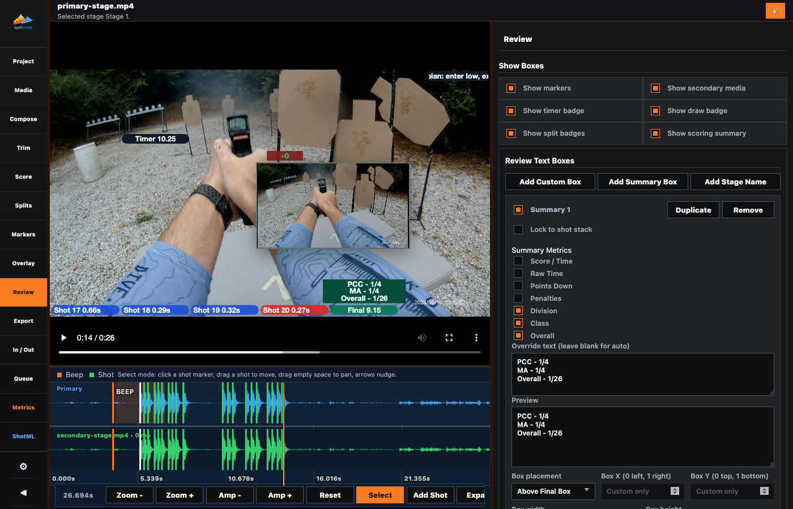
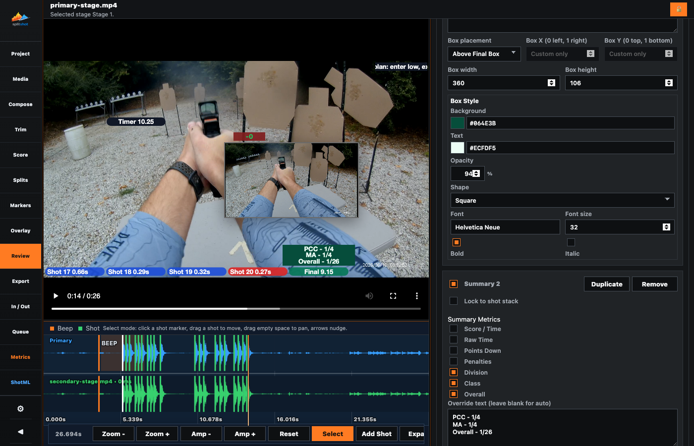

# Review Pane

The Review pane controls preview/export artifact visibility, Summary boxes, and custom boxes. It is where you decide which overlay badges remain visible, choose which metrics appear in a Summary box, and tune each box's placement, size, color, and opacity.

## When To Use This Pane

- After Overlay placement is close to final.
- When you need to hide or show timer, draw, split, or scoring badges.
- When you want a Summary box after the final shot.
- When you need a custom text note or stage-plan callout.
- When you want to choose which imported USPSA/IDPA metrics appear in the Summary overlay.

## Key Controls

| Control | What it does |
| --- | --- |
| `Show markers` | Shows or hides markers. |
| `Show added media` | Shows or hides added media (Compose). |
| `Show timer badge` | Shows or hides the timer badge. |
| `Show draw badge` | Shows or hides the draw badge. |
| `Show split badges` | Shows or hides the shot badge stack. |
| `Show scoring summary` | Shows or hides the final result badge. |
| `Add Custom Box` | Adds a manually typed text box. |
| `Add Summary Box` | Adds a PractiScore-backed summary box. |
| Box enable checkbox | Turns one text box on or off. |
| `>` / `v` | Expands or collapses that box editor. |
| `Duplicate` | Copies the box and its styling. |
| `Remove` | Deletes the box. |
| Top-right lock icon | Unlocks or relocks the shared layout resize controls from the upper-right corner of the top status bar. The inspector header no longer duplicates this icon. |
| `Lock to shot stack` | Makes the box follow the overlay shot stack instead of independent placement. |
| `Metric checklist` | Chooses which Summary metrics render in the box. |
| `Box text` | Edits the visible text for the box. |
| `Box placement` | Chooses `Above Final Box`, a fixed anchor, or `Custom`. |
| `Box X` / `Box Y` | Set direct normalized placement when custom placement is available. |
| `Box width` / `Box height` | Force text-box dimensions. |
| `Background`, `Text`, `Opacity` | Style the rendered box. |
| Color swatches | Open the shared color picker modal shown in [overlay.md](overlay.md). |

## Summary

When PractiScore results are imported, each Summary box exposes its own metric checklist and preview.

Available metrics render in this fixed order:

1. `Score / Time`
2. `Raw Time`
3. `Points Down`
4. `Penalties`
5. `Overall Placement`
6. `Division Placement`
7. `Class Placement`
8. `Division + Class Placement`
9. `Overall Percent`
10. `Division Percent`
11. `Class Percent`
12. `Division + Class Percent`
13. `Overall Gap`
14. `Division Gap`
15. `Class Gap`
16. `Division + Class Gap`

Unchecked metrics do not render. Metrics that are unavailable from the imported data stay hidden or blank.

## How To Use It

1. Scrub near the final shot so summary behavior is visible.
2. Toggle the four badge visibility checkboxes to match the preview/export you want.
3. Use `Add Summary Box` to add a Summary box.
4. Use `Add Custom Box` for a typed note, title, or stage plan.
5. Check the metrics you want in the Summary box.
6. Expand or collapse cards with `>` / `v`; the pane preserves the clicked card position so the inspector does not jump vertically.
7. Use `Above Final Box` for a summary that should sit above the final result badge.
8. Use `Custom` placement plus X/Y, or drag the rendered box in the video, when the box needs an exact location.
9. When `Lock to shot stack` is on, dragging that rendered box moves the whole locked stack and keeps the box locked.
10. Adjust width, height, colors, and opacity until the text reads clearly over the footage.
11. Use a color swatch when you want the expanded picker with quick swatches and HSL/hex controls.
12. Check the Summary box preview to verify stage placement, times, penalties, and classifications.

## Summary Box Behavior

- Summary boxes render the checked metrics in the fixed order shown above.
- `Above Final Box` keeps a summary aligned with the final score/result badge.
- Locked boxes keep the same spacing relationship as the shot stack. Drag any locked item to reposition the stack as a group.
- Custom boxes stay visible according to their own enable state and placement.
- Enabled review boxes render into export.

## Common Fixes

| Problem | Fix |
| --- | --- |
| The Summary box is empty. | Import PractiScore in [project.md](project.md), then check at least one metric. |
| X/Y fields are disabled. | Use `Custom` placement and turn off `Lock to shot stack`. |
| A box moved after overlay changes. | That is expected when `Lock to shot stack` is on. |
| A box is missing from export. | Confirm the box enable checkbox is on. |
| A badge is hidden even though Overlay is configured. | Recheck the Review visibility toggles. |

## Related Guides

Previous: [popup.md](popup.md) (Markers)
Next: [export.md](export.md)
