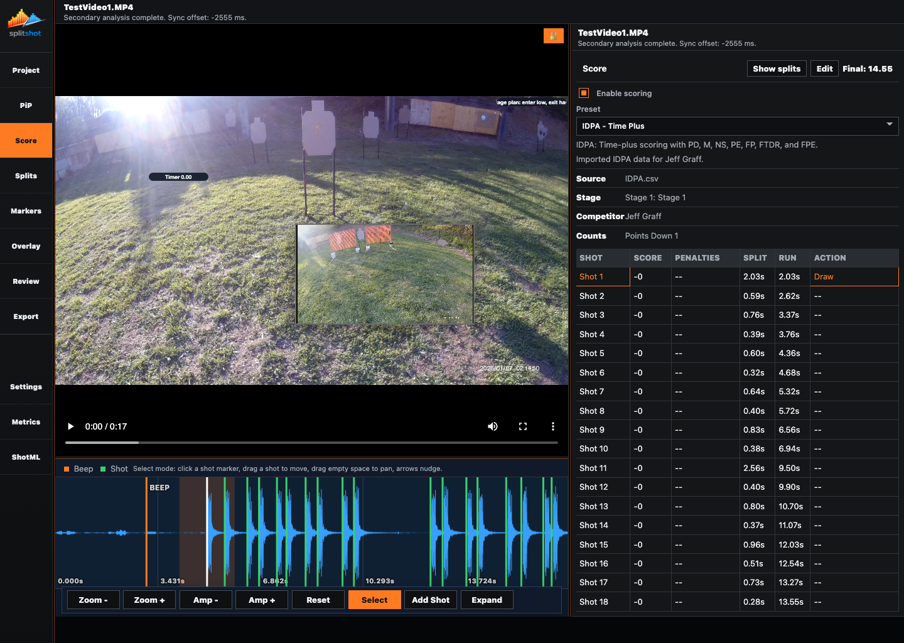

# Score Pane

The Score pane applies a ruleset to the current shot list. It shows imported match context, enables scoring, assigns score values per shot, edits per-shot penalties, and lets you restore or delete individual shots from the scoring surface.

## When To Use This Pane

- After the shot list is close to final in [splits.md](splits.md).
- When you need per-shot score letters and penalties.
- When you want to compare SplitShot timing against PractiScore official timing.
- When you need to restore or remove a shot while reviewing score rows.

## Key Controls

| Control | What it does |
| --- | --- |
| `Enable scoring` | Turns scoring calculations on or off. |
| `Preset` | Selects the scoring model, such as IDPA Time Plus. Available score labels and penalties follow the preset. |
| Imported context rows | Show source file, stage, competitor, points down/counts, and official values from PractiScore. |
| Shot card header | Selects the shot and seeks the shared video/waveform context to that shot. |
| Shot card `>` / `v` | Expands or collapses that shot's score controls without changing the surrounding pane state. |
| Score dropdown | Sets the score value for that shot, such as `-0`, `A`, `C`, `D`, `M`, or `NS`, depending on preset. |
| Penalty fields | Apply preset-specific per-shot penalties such as `NT`, `PE`, `FP`, `FTDR`, or `FPE`. |
| `Restore` | Restores that shot's original score and penalty values when available. |
| `Delete` | Removes that shot from the run. |

## How To Use It

1. Turn on `Enable scoring`.
2. Select the correct `Preset`.
3. Confirm the imported stage and competitor rows if PractiScore is loaded.
4. Expand shot cards with `>` and choose the correct score value for each shot.
5. Enter any per-shot penalties exposed by the active preset.
6. Use `Restore` to reset one shot's score state without affecting the rest of the run.
7. Use `Delete` only when the timing row itself should be removed.

## Score Text And Penalties

- IDPA-style presets use values like `-0`, `-1`, and `-3`.
- USPSA/IPSC-style presets commonly use `A`, `C`, `D`, `M`, `NS`, and combined miss/no-shoot values.
- Shot-linked markers read their visible text from the score and penalty state here.
- Metrics, Review summary boxes, Overlay result badges, and Export all use the live scoring summary.

## Common Fixes

| Problem | Fix |
| --- | --- |
| The wrong score labels are visible. | Recheck `Preset`. |
| A shot is missing from Score. | Fix the shot list in [splits.md](splits.md). |
| PractiScore comparison looks wrong. | Recheck the imported stage and competitor in [project.md](project.md). |
| A marker changed after rescoring. | That is expected for shot-linked markers. |
| Metrics changed after a penalty edit. | That is expected. Metrics is built from the live scoring summary. |

## Related Guides

Previous: [splits.md](splits.md)
Next: [pip.md](pip.md)

**Last updated:** 2026-04-23
**Referenced files last updated:** 2026-04-23
