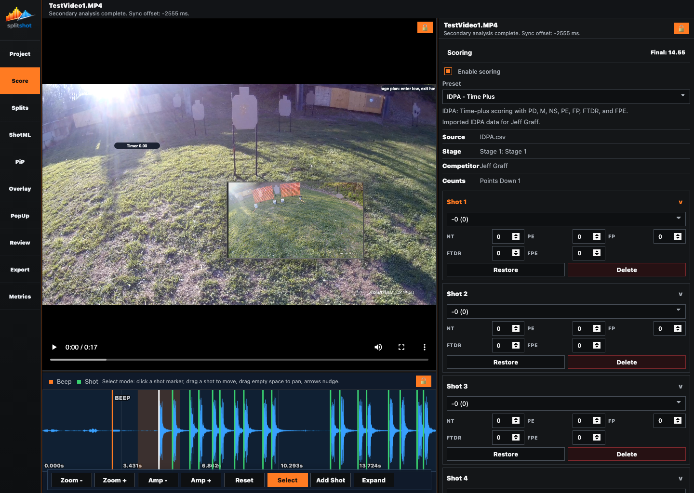

# Score Pane

The Score pane applies ruleset-aware scoring to the current shot list. Use it to enable scoring, choose the preset, review imported PractiScore context, assign per-shot score letters, edit ruleset-specific penalties, and restore a shot to its original score when needed.

## When To Use This Pane

- After the shot list is stable in [splits.md](splits.md).
- When you want a manual score for each shot.
- When you want to compare your video run against PractiScore stage context.
- When you need to restore or delete a specific shot from the scoring surface.

## Before You Start

- Finish the first timing pass in [splits.md](splits.md) first.
- Import PractiScore in [project.md](project.md) if you want official stage context.
- Expect the available score letters and penalty fields to change when the preset changes.

## Key Controls

| Control | What it does |
| --- | --- |
| `Enable scoring` | Turns scoring calculations on or off for the current project. |
| `Preset` | Chooses the active scoring ruleset, such as IDPA, USPSA, IPSC, Steel Challenge, or GPA. |
| Preset description line | Explains the active ruleset in plain language. |
| Imported caption and details | Show the staged PractiScore source, match type, official raw time, video raw time, raw delta, current calculated result, and official final time when imported data exists. |
| Score option tiles | Show the legal score letters for the current preset and the value or penalty attached to each one. This reference sits below the shot rows. |
| Shot header | Selects that shot in the shared review/timing context. |
| Expand/collapse chevron | Shows or hides the scoring controls for an individual shot. A collapsed row shows only the shot number and current score, such as `Shot 1 - A`, plus the chevron needed to reopen it. |
| Shot score dropdown | Assigns the score letter for that shot. |
| Per-shot penalty inputs | Apply ruleset-specific penalty counts such as `NT`, `PE`, `FP`, `FTDR`, or `FPE` when the preset exposes them. |
| `Restore` | Restores the shot's original score and penalty values when SplitShot still has them. |
| `Delete` | Removes the shot from the run directly from the Score pane. |

## How To Use It

1. Turn on `Enable scoring`.
2. Choose the correct `Preset` for the sport and scoring model you want.
3. If PractiScore is loaded, compare `Official Raw`, `Video Raw`, `Raw Delta`, the current result row, and `Official Final` against the stage you expect before scoring shots.
4. Expand each shot row, assign the correct score letter, and fill in any ruleset-specific penalty inputs on that row.
5. Use the score option tiles below the shot rows as the shorthand legend for the current preset.
6. Use `Restore` when a row drifted away from the original imported or default value and you want to reset only that shot.
7. Use `Delete` only when the shot itself should be removed from the run, not just rescored.

## Score Letters And Shorthand

- IDPA-style presets use `-0`, `-1`, and `-3` for points down.
- USPSA and IPSC-style presets commonly use `A`, `C`, `D`, `M`, `NS`, and `M+NS`.
- `M` means miss.
- `NS` means no-shoot.
- `PE` means procedural error.
- `FP` means flagrant penalty.
- `FTDR` means failure to do right.
- `FPE` means finger procedural error.
- Other presets can replace the visible letters entirely. Always trust the current score-option tiles for the active preset.

## Penalty Behavior

SplitShot's current Score pane is shot-local. Ruleset-specific penalty inputs live on each shot row, not in a separate global penalty editor. Imported manual penalties can still affect the scoring summary when they come from PractiScore, but the visible editing surface in the current pane is the per-shot row.

## PractiScore Comparison Rows

- `Official Raw` is the raw stage time from PractiScore.
- `Video Raw` is SplitShot's raw time from the current shot list.
- `Raw Delta` is the difference between the official raw time and the video-derived raw time.
- The current result row uses the active ruleset label, such as final time or hit factor, from SplitShot's live scoring summary.
- `Official Final` is the final stage result imported from PractiScore.

## How It Affects The Rest Of SplitShot

- Metrics updates the result, penalties, and scoring context immediately.
- Overlay uses the current scoring summary and score text colors for the final score badge.
- PopUp uses the current per-shot score and penalties for shot-linked popup text.
- Review uses the same scoring summary for imported summary boxes and final-stage presentation.
- Export burns in the current scoring state, not the original untouched run.

## Common Mistakes And Fixes

| Problem | Fix |
| --- | --- |
| The wrong score letters are showing. | Recheck `Preset`. The legal score letters depend on the active ruleset. |
| A shot disappeared from the scoring list. | Return to [splits.md](splits.md). The shot list comes from the timing model. |
| The imported summary does not match the run. | Recheck the PractiScore stage and competitor selection in [project.md](project.md). |
| You expected a separate global penalty field. | Use the per-shot penalty inputs in the visible shot rows. The current pane is shot-local. |
| Metrics or Overlay changed after rescoring. | That is expected. Those panes use the live scoring summary from the current shot list. |
| A PopUp changed after rescoring. | That is expected for shot-linked popups. Edit the score row when you want the popup text to change. |

## Related Guides

Previous: [splits.md](splits.md)
Next: [pip.md](pip.md)

**Last updated:** 2026-04-21
**Referenced files last updated:** 2026-04-21
