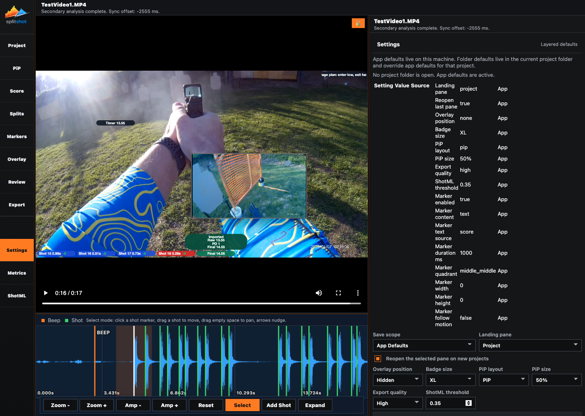

# Settings Pane

The Settings pane controls SplitShot defaults instead of the current run. It shows which layer currently supplies each value, lets you choose where edits are saved, and exposes the default marker template used for imported shot-linked markers.

## Settings Layers

SplitShot applies defaults in this order:

1. App defaults stored on this machine.
2. Folder defaults stored in `splitshot.conf` inside the current project folder.
3. Project-specific marker edits saved in the project bundle.

The summary table in the pane shows the effective value and whether it currently comes from `App`, `Folder`, `Project`, or the merged effective value.

## When To Use This Pane

- Before starting a batch of similar projects.
- When one project folder should carry its own default layout or detector values.
- When imported shot-linked markers should start with different duration, placement, or content defaults.
- When you need to confirm why the current effective setting is different from the app-wide default.

## Key Controls

| Control | What it does |
| --- | --- |
| Settings layer summary | Lists the current effective values and the layer that supplied each one. |
| `Save scope` | Chooses whether edits are written to `App Defaults` or `Folder Defaults`. |
| `Landing pane` | Chooses which left-rail pane opens first. |
| `Reopen the selected pane on new projects` | Reuses the last active pane when a new project opens. |
| `Overlay position` | Sets the default overlay edge. |
| `Badge size` | Sets the default overlay badge scale. |
| `PiP layout` | Sets the default added-media layout mode. |
| `PiP size` | Sets the default picture-in-picture size. |
| `Export quality` | Sets the default export quality target. |
| `ShotML threshold` | Sets the default detection threshold for new projects. |
| `Marker Template` | Sets the default content, duration, placement, size, and motion behavior for imported shot-linked markers. |
| `Reset Defaults` | Clears the selected defaults layer and falls back to the next available layer. |

## Folder Defaults

- Folder defaults only exist when a project folder is open.
- SplitShot stores them in `splitshot.conf` in that folder.
- They override app defaults only for that folder.
- If the file does not exist yet, the pane tells you the effective values are still coming from app defaults.
- If `splitshot.conf` is invalid, SplitShot ignores it, keeps the project open, and reports the problem in the scope status line.

## Marker Template Defaults

The marker template affects newly imported shot-linked markers. It does not retroactively rewrite markers you already edited in the project.

Use it to set:

- whether imported markers start enabled
- whether they use text, image, or text plus image
- which text source they use by default
- duration, quadrant, width, and height
- whether imported markers follow motion by default

## How To Use It

1. Open a project folder if you want folder-specific defaults.
2. Check the scope status line to see whether app or folder defaults are currently active.
3. Review the settings summary table to see where each effective value comes from.
4. Choose `Save scope` before making edits.
5. Change the defaults you want to carry into future projects or imports.
6. Adjust the `Marker Template` before running `Import Shots` in the Markers pane when imported markers should share new defaults.
7. Use `Reset Defaults` when a layer should fall back to the next lower layer.

## Common Fixes

| Problem | Fix |
| --- | --- |
| `Folder Defaults` is unavailable. | Open or choose a project folder first. |
| A setting is not using the value you expected. | Check the layer summary table to see whether `Folder` or `Project` is overriding `App`. |
| A project reopens with old defaults. | Check whether `splitshot.conf` in that folder is still present and overriding app defaults. |
| Reset did not keep the previous folder behavior. | `Reset Defaults` clears the selected layer. If you reset folder defaults, SplitShot falls back to app defaults. |
| Imported shot markers still use the old layout. | Change the marker template before importing shots again; existing marker edits are not rewritten automatically. |

## Related Guides

Previous: [export.md](export.md)
Next: [metrics.md](metrics.md)

**Last updated:** 2026-04-23
**Referenced files last updated:** 2026-04-23