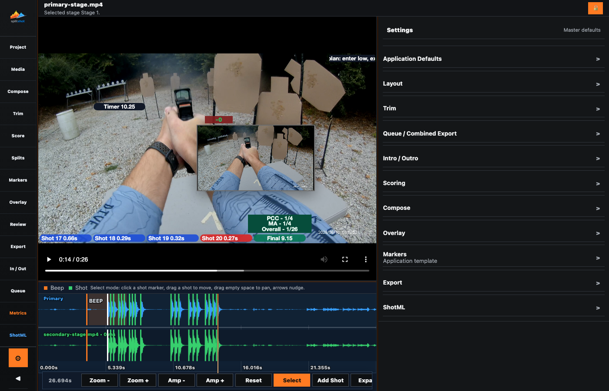
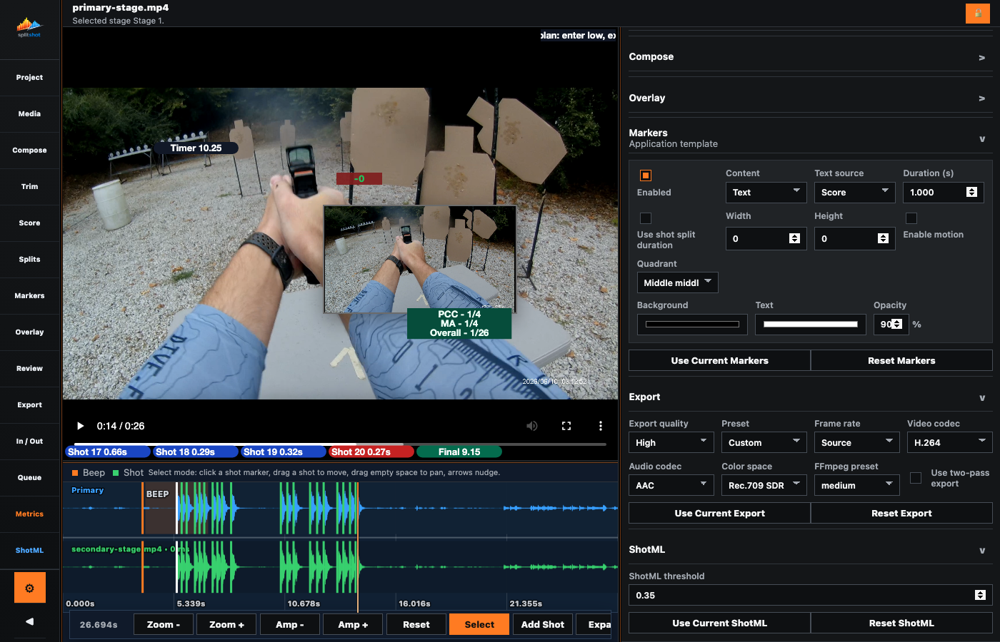

# Settings Pane

<!-- Documentation reviewed: 2026-08-11 -->

The Settings pane controls application defaults for layout, Trim, scoring, Compose, Overlay and Review, markers, In/Out, Queue, export, and ShotML.

## When To Use This Pane

- Before starting a new project, to set preferred defaults.
- When you want to change the landing pane or reopen-last-tool behavior.
- When you want to capture the current project's layout as the default.
- When you want to tune default marker templates.
- When every newly created or imported stage should start from the same reusable settings.

## Key Controls

### Application Defaults

| Control | What it does |
| --- | --- |
| `Landing pane` | Sets which pane opens by default when a new project is created. |
| `Reopen the selected pane on new projects` | Remembers the last-used pane and reopens it on the next project. |
| `Save Current Project as Application Defaults` | Flushes pending edits, then copies the whitelisted reusable project settings into application `settings.json`. Media, identity, timing results, marker instances, destinations, logs, and Queue history are excluded. |
| `Reset Application Defaults` | Restores application defaults to factory values. |
| Status hint | Confirms that legacy `splitshot.conf` files are preserved but ignored. |

### Layout

| Control | What it does |
| --- | --- |
| `Lock layout by default` | Starts new projects with the layout locked. |
| `Rail width` | Default rail width for new projects. |
| `Inspector width` | Default inspector panel width for new projects. |
| `Waveform height` | Default waveform height for new projects. |
| `Save Current Settings` | Captures the current project's layout as the default. |
| `Release Layout` | Clears saved layout defaults, reverting to built-in defaults. |

### Scoring

| Control | What it does |
| --- | --- |
| `Default sport` | Sets the starting match type for new projects (USPSA, IPSC, IDPA). An imported file overrides this. |

### Compose

The Compose section owns application Compose defaults. Source styling is stored as a slot template; source paths, IDs, trim state, and sync offsets are never copied.

| Control | What it does |
| --- | --- |
| `Layout` | Default layout for new added media. |
| `Size` | Default item size. |
| `X` / `Y` | Default normalized position for new items. |

### Overlay

| Control | What it does |
| --- | --- |
| `Overlay position` | Default overlay anchor. |
| `Badge size` | Default badge scale preset. |
| `Stage box background` / `Stage box text` / `Stage box Opacity` | Default stage-summary box colors and opacity. |
| Timer / Shot / Current Shot / Score badge cards | Default per-badge background, text color, and opacity for new projects. |

### Markers

| Control | What it does |
| --- | --- |
| `Enabled` | Whether new markers start enabled. |
| `Content` | Default marker content type (Text, Image, Text + Image). |
| `Text source` | Default text source for new markers. |
| `Duration (s)` | Default marker duration. |
| `Use shot split duration` | Marker duration follows the shot split instead of a fixed value. |
| `Width` / `Height` | Default marker dimensions (0 = auto). |
| `Enable motion` | Whether new markers start with motion enabled. |
| `Background` / `Text` / `Opacity` | Default marker colors and opacity. |

### Export

| Control | What it does |
| --- | --- |
| `Export quality` | Default export quality preset. |
| `Preset` | Default export preset. |
| `Frame rate` | Default export frame rate. |
| `Video codec` | Default video encoder. |
| `Audio codec` | Default audio encoder. |
| `Color space` | Default color pipeline. |
| `FFmpeg preset` | Default encoder speed/efficiency trade-off. |
| `Use two-pass export` | Default two-pass encoding setting. |

### ShotML

| Control | What it does |
| --- | --- |
| `ShotML threshold` | Default detection threshold for new projects. |

## How To Use It

1. Expand each section with the chevron to reveal its controls.
2. Adjust the `Landing pane` and `Reopen the selected pane on new projects` before starting a new project.
3. Use `Save Current Project as Application Defaults` to capture every whitelisted reusable setting together. Section buttons update only that section.
4. Use `Reset Application Defaults` when you want to start fresh.
5. For layout, use `Use Current Layout` after arranging the workspace exactly as you want new projects to open.
6. Marker template changes apply to newly created markers, not existing marker instances or placements.

## Defaults Behavior

- Application defaults are stored in `settings.json` and apply to empty projects, manually added stages, and newly imported stages, including after restarting SplitShot.
- Existing projects retain their saved project-specific values.
- Saving defaults never copies project or competitor identity, imported results, media paths, detected timing data, Queue membership/history, output destinations, or marker instances/placements.
- Existing legacy `splitshot.conf` files remain on disk but do not override application defaults.

## Related Guides

Previous: [shotml.md](shotml.md)
Next: [../workflow.md](../workflow.md)
