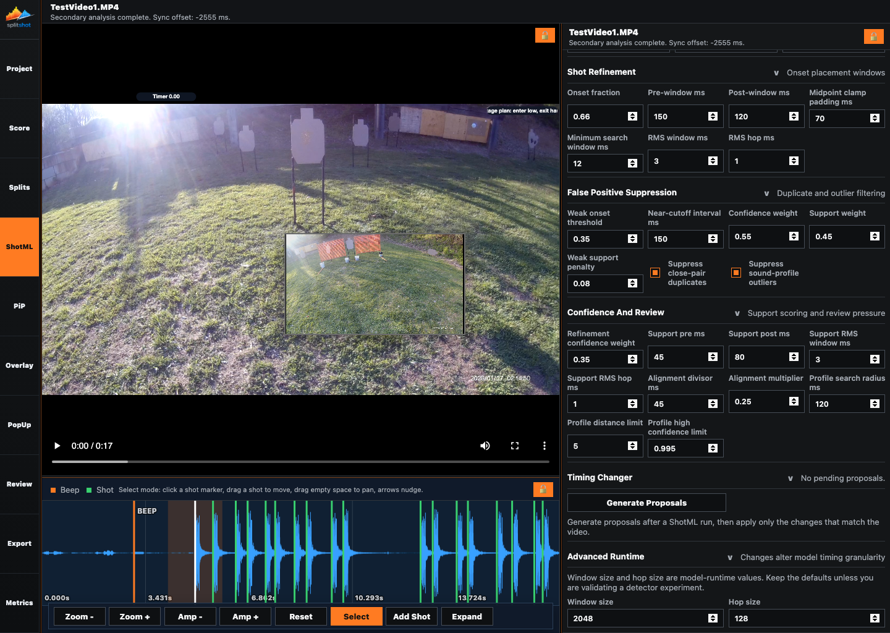

# ShotML Pane

The ShotML pane controls automatic beep and shot detection. It is where you tune detector sensitivity, rerun analysis, review timing-change proposals, and adjust advanced detector behavior before doing detailed manual timing.

## When To Use This Pane

- After importing a primary video and before detailed manual timing.
- When quiet shots are missing.
- When echoes, props, or spectators were detected as shots.
- When the beep marker consistently lands early or late.
- When you want detector suggestions converted into explicit `Apply` or `Discard` proposals.

## Main Actions

| Control | What it does |
| --- | --- |
| `Re-run ShotML` | Replaces the automatic beep and shot detections using the current settings. Manual timing edits remain available in Splits. |
| `Reset Defaults` | Restores the current project to the factory detector profile. |
| Section chevrons | Expand or collapse each detector group. |
| `Generate Proposals` | Converts ShotML review suggestions into pending timing changes. |
| Proposal `Apply` / `Discard` | Applies or rejects one proposed timing change. |

## Threshold

| Control | What it changes |
| --- | --- |
| `Detection threshold` | Overall shot sensitivity. Lower accepts quieter shots; higher rejects more noise. |
| `Cutoff base` | Base probability cutoff used by model peak picking. |
| `Cutoff span` | How much the cutoff changes as threshold changes. |

Start here first. Most videos should need only threshold changes plus a rerun.

## Beep Detection

| Control group | What it changes |
| --- | --- |
| Onset/search/tail/fallback fields | Where the app searches for the timer beep and how it avoids the first shot. |
| FFT fields | Fallback tonal-beep search windows, hops, and frequency band. |
| Tonal fields | Main tonal scoring windows, hops, and frequency band. |
| Refine/gap/exclusion fields | Final beep refinement, first-shot gap, and shot exclusion radius. |
| Region/model fields | Weighted region cutoff and model boost behavior for beep selection. |

Use this section when the shot count looks good but all times are shifted because the beep marker is wrong.

## Shot Candidate Detection

| Control | What it changes |
| --- | --- |
| `Minimum shot interval ms` | Hard minimum spacing between valid shots. |
| `Peak minimum spacing ms` | Peak-picking spacing before refinement and filtering. |
| `Confidence source` | How model classes become shot confidence. |

Use this section when the detector finds too many close pairs or suppresses legitimate fast pairs.

## Shot Refinement

| Control group | What it changes |
| --- | --- |
| `Onset fraction` | Where the timestamp lands inside the local waveform onset. |
| Pre/post/search fields | How wide the local refinement window is. |
| RMS fields | Frame and hop size for local onset refinement. |
| `Midpoint clamp padding ms` | How much room close shots keep around inter-shot midpoint clamps. |

Use this when the shot count is right but markers consistently land early or late.

## False Positive Suppression

| Control | What it changes |
| --- | --- |
| `Weak onset threshold` | Defines low waveform support. |
| `Near-cutoff interval ms` | Close-pair review window. |
| `Confidence weight` / `Support weight` | Balance model confidence against waveform support. |
| `Weak support penalty` | Penalizes candidates with weak onset support. |
| `Suppress close-pair duplicates` | Removes weaker close-pair duplicates. |
| `Suppress sound-profile outliers` | Removes shots that do not match the stage sound profile. |

Turn suppression off only when you can see and hear real shots being removed.

## Confidence And Review

This section controls the confidence and review pressure shown in timing/metrics context. It is useful when proposals are too aggressive or too quiet.

| Control group | What it changes |
| --- | --- |
| Refinement/support fields | How waveform support affects confidence. |
| Alignment fields | Penalty for support that is far from the marker. |
| Profile fields | How sound-profile outliers are searched and protected. |

## Timing Changer And Runtime

- `Generate Proposals` creates pending rows for move-beep, move-shot, suppress-shot, restore-shot, or close-pair decisions.
- Proposals do not edit the timeline until applied.
- Advanced runtime fields such as `Window size` and `Hop size` affect model granularity and runtime cost. Keep defaults unless you are validating detector experiments.

## Relationship To Splits

ShotML controls automatic detection. Splits controls the final timeline. Rerun ShotML before detailed manual edits whenever possible, then finish marker nudging, manual shots, and timing events in [splits.md](splits.md).

## Common Fixes

| Problem | First thing to try |
| --- | --- |
| Quiet shots are missing. | Lower `Detection threshold`, then `Re-run ShotML`. |
| Echoes became shots. | Raise `Detection threshold`, then rerun. |
| Fast pairs are removed. | Lower `Minimum shot interval ms` or disable close-pair suppression. |
| All shots are shifted. | Tune Beep Detection, then rerun. |
| Count is right but markers are late. | Lower Shot Refinement `Onset fraction`. |
| Count is right but markers are early. | Raise Shot Refinement `Onset fraction`. |
| Proposal list is empty. | Rerun ShotML, then click `Generate Proposals`. |

## Related Guides

Previous: [project.md](project.md)
Next: [splits.md](splits.md)

**Last updated:** 2026-04-22
**Referenced files last updated:** 2026-04-22
