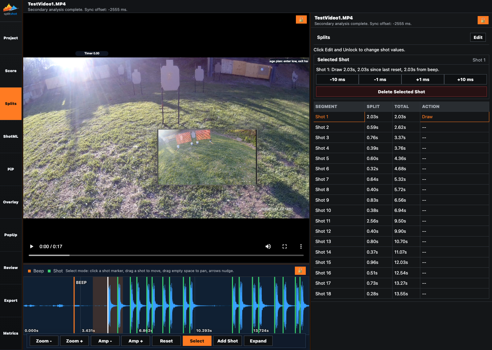
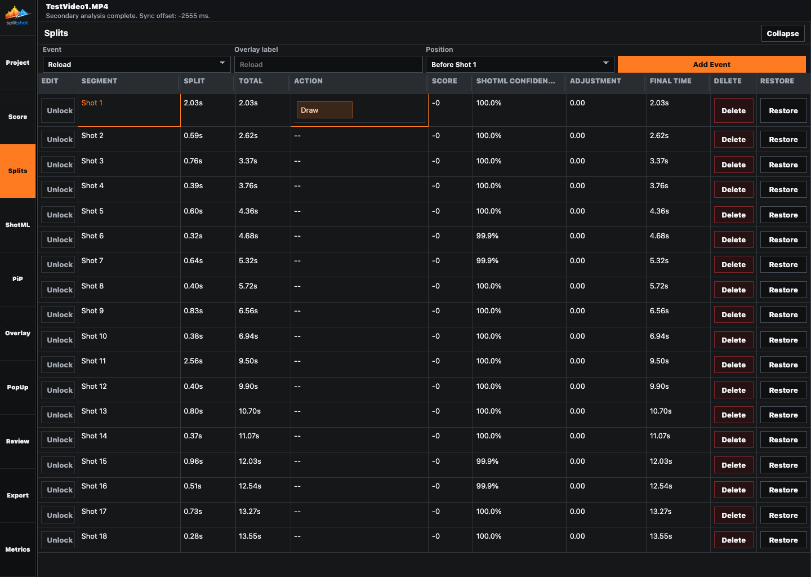
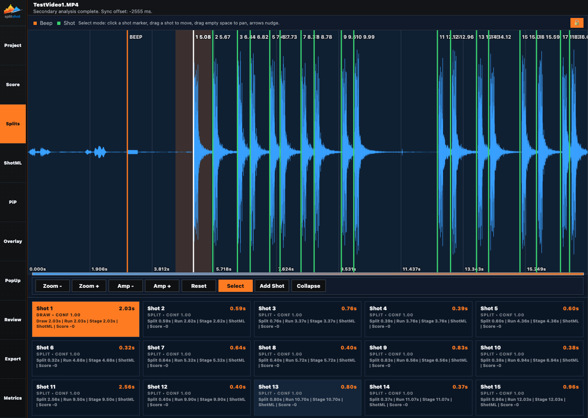

# Splits Pane

The Splits pane is the manual timing workbench. It shows the selected shot, nudge controls, timing rows, the waveform, and expanded editing modes for detailed split review.

## When To Use This Pane

- After primary video analysis finishes.
- When the detected shot count or marker placement needs review.
- When you need to nudge, drag, add, or delete shots.
- When you need reload, malfunction, or custom timing-event labels.
- After ShotML has produced the best automatic draft you can get.

## Compact Pane Controls

| Control | What it does |
| --- | --- |
| `Edit` | Opens the expanded timing table. |
| `Selected Shot` | Shows the active shot number, split, total time, and time since beep. |
| `-10 ms`, `-1 ms`, `+1 ms`, `+10 ms` | Nudges the selected shot earlier or later. |
| `Delete Selected Shot` | Removes the active shot. |
| Timing table | Lists segment name, split, total, and action context for every row. |

## Waveform Controls

| Control | What it does |
| --- | --- |
| Orange beep marker | Shows the detected start signal. |
| Green shot markers | Show detected and manual shots. |
| `Select` | Lets you select and drag existing markers. |
| `Add Shot` | Places a manual shot where you click the waveform. |
| `Zoom -` / `Zoom +` | Changes the visible time range. |
| `Amp -` / `Amp +` | Changes waveform amplitude scale. |
| `Reset` | Restores the default waveform view. |
| `Expand` | Opens the waveform-focused layout. |

## Expanded Timing Controls

| Control | What it does |
| --- | --- |
| `Collapse` | Returns to the compact pane. |
| `Event` | Chooses a timing event type such as reload, malfunction, or custom label. |
| `Overlay label` | Sets the label used by the event row and overlay. |
| `Position` | Anchors the event before, between, or after shots. |
| `Add Event` | Inserts the timing event. |
| `Unlock` | Enables inline row editing for direct timing changes. |
| `Segment`, `Split`, `Total`, `Action` | Show the timing row, interval, cumulative time, and event context. |
| `Score`, `Confidence`, `Source` | Mirror scoring value, ShotML confidence/manual state, and row origin. |

## How To Use It

1. Confirm the shot count in the compact timing table.
2. Select a shot from the table or waveform.
3. Use the nudge buttons for small timestamp fixes.
4. Drag waveform markers for larger timing corrections.
5. Use `Add Shot` when the detector missed a real shot.
6. Use `Delete Selected Shot` for false detections.
7. Use `Edit` for detailed timing rows and event insertion.
8. Use the waveform `Expand` state when you need more room to inspect peaks.

## Common Fixes

| Problem | Fix |
| --- | --- |
| Quiet shots are missing. | Lower `Detection threshold` in [shotml.md](shotml.md), rerun ShotML, or add the shot manually. |
| Extra noise became shots. | Raise `Detection threshold`, rerun ShotML, then delete remaining false rows. |
| A marker is close but not exact. | Select it and nudge by 1 ms or 10 ms. |
| A reload label is in the wrong place. | Recheck the event `Position`. |
| Score or Metrics changed after timing edits. | That is expected. They follow the live shot list. |

## Related Guides

Previous: [shotml.md](shotml.md)
Next: [score.md](score.md)

**Last updated:** 2026-04-22
**Referenced files last updated:** 2026-04-22
