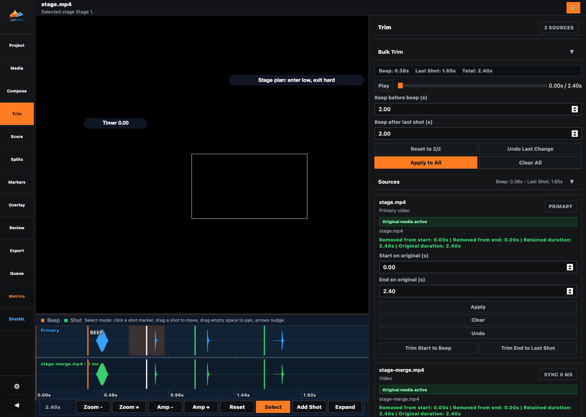

# Trim Pane

The Trim pane creates project-managed media derivatives for the active stage. It can trim every video around the detected run or apply different trim and synchronization values to individual sources.

## Use This Pane For

- Keeping a fixed amount of video before the beep and after the last shot.
- Applying or clearing a bulk trim across the active stage.
- Applying a different start and end trim to one source.
- Aligning added videos with the primary video.
- Returning to the original source or undoing the latest trim change.

## Bulk Trim

| Control | What it does |
| --- | --- |
| `Play` / scrubber | Previews the active video and shows the current position. |
| `Keep before beep` | Keeps this many seconds before the detected beep. |
| `Keep after last shot` | Keeps this many seconds after the final shot. |
| `Reset to 2/2` | Restores two seconds before and after the run. |
| `Undo Last Change` | Restores the previous trim state. |
| `Apply to All` | Creates trim derivatives for every trimmable source in the active stage. |
| `Clear All` | Returns all stage sources to their originals. |

## Source Controls

Each source card identifies the original file and whether original or trimmed media is active.

| Control | What it does |
| --- | --- |
| `Trim start` / `Trim end` | Set the source-specific retained range in seconds. |
| `Apply` | Creates and activates the derivative for that source. |
| `Clear` | Returns that source to its original media. |
| `Undo` | Restores the previous trim state for that source. |
| `Trim Start to Beep` | Sets the start from the detected beep. |
| `Trim End to Last Shot` | Sets the end from the final shot. |
| `Sync offset` and nudge buttons | Align an added video with the primary video. |
| `Analyze Sync` / `Re-run Sync` | Calculates a suggested sync relationship for added video. |

Still images and animated GIFs are not trimmed. Trim derivatives remain inside the project `Input/` area, and clearing a trim changes the active source back to the original without removing the original media.

## Related Guides

Previous: [compose.md](compose.md)
Next: [score.md](score.md)
