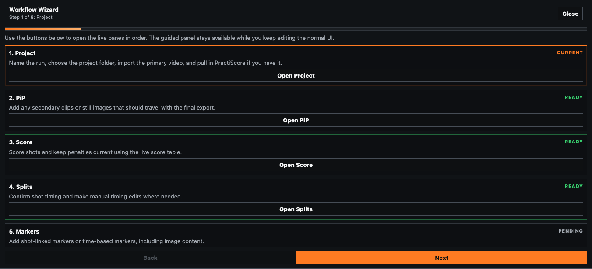

# Workflow Wizard

The Workflow Wizard is a guided panel that sits above the review grid. It does not replace the live panes; it keeps the normal UI available while giving you a stable order to follow from Project through Export.

## When To Use It

- When you are starting a new project and want the standard flow spelled out.
- When you want a reminder of the pane order without hunting through the rail.
- When you are handing a project to someone who is not yet familiar with the app.

## How It Works

1. Open [project.md](panes/project.md) and click `Start Wizard`.
2. Use `Back` and `Next` to jump between steps.
3. Use `Open Step` on any card to jump straight to that pane.
4. Keep editing the live panes below while the wizard stays visible above them.
5. Close the wizard when you do not need the guide anymore.

## Step Order

The wizard follows the same live-pane order used by the browser shell:

1. Project
2. PiP
3. Score
4. Splits
5. Markers
6. Overlay
7. Review
8. Export

## Related Guides

Previous: [USER_GUIDE.md](USER_GUIDE.md)
Next: [workflow.md](workflow.md)

**Last updated:** 2026-04-23
**Referenced files last updated:** 2026-04-23